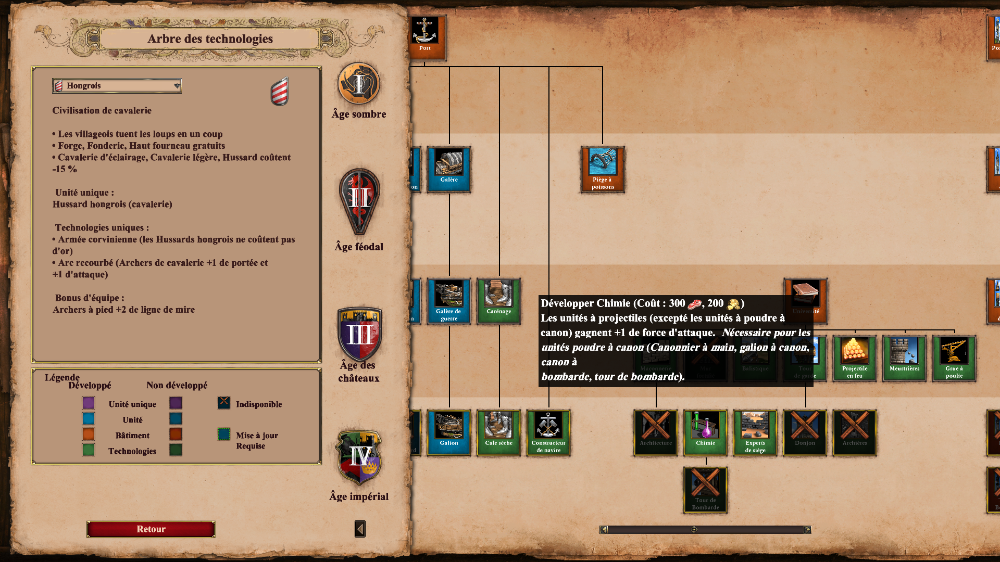

+++
title = "Reverse engineering Age of Empires II - Part I - Text Helpers"
date = 2021-07-28
+++

## Introduction 

In this blog series I will share my Ao2DE reverse engineering journey. I will try my best
to spare you all the boring details, hour of digging through AoE2 game data and abandoned github repository.  

People have been reverse engineering Ao2 for two decade, and I wouldn't be going anywhere 
if it was not standing on those giant shoulders.

I won't go to deep in the actual implementation, but I will assume some basic coding knowledge along the articles.
I will use the following languages/technologies: Rust, Java, Quarkus, Postgresql. 

The work I am doing here will be shared on GitHub under the [scout.gg](https://github.com/scout-gg) organization.
At the moment most of our repositories are not ready to use and are still in private mode. We will release everything once
we are ready. Meanwhile, anyone wanting to contribute is more that welcome.

### Memories

Before going further I would like to share some reminiscence. 

I've been playing Age of Empires for two decades now. Actually Age of Empire I is the first game I ever played. 
In 1998, we had no computer at home, so my father took me to is office from time to time to play AoE for a couple of hour. 

In the early 2000s I used to play at one of my friend's home with his elder brother.
We were playing in separate rooms so no one can cheat looking at is opponent screen. 
Later during high school we organized 4vs4 AoE2 LANs with friends.
I was in charge of settings up the network for everyone and bringing a cracked version
of Ao2 the conquerors (don't tell Microsoft please). 
We drank beer, smoked marijuana and spammed **14** playing the best game ever made. 

Evoking this memory fills me with nostalgia, and I am pretty sure most AoE2 players of my generation can relate.

### Age of Empires versions 

Since the first release of Age of Empires II in 1999 many extensions and new versions were published :
- The conqueror : the first expansion pack release in 2000 
- HD Edition and its many addons (2013) 
    - The Forgotten
    - The African Kingdoms
    - Rise of the Rajas
- Definitive Edition
    - Lords of the West
    - Dawn of the Dukes

Along this blog post we will focus on the Definitive editions. Its the latest and most popular version. 

## Siege Engineers

One day, my friend Alex told me he was working on an [aoe2techtree](https://aoe2techtree.net) clone.
He started this as a hobby project to learn a new javascript framework. I was quite interested and 
when he told me how hard it was for him to collect gamedata I started to look at aoe2techtree codes 
to understand where the data came from. 

Turns out there is developper collective dedicated to Age of Empire reverse engineers called [Siege Engineer](https://aoe2.se/).
The amount of amazing project going on there is just incredible. Game record analysis, techtree, game replay, modding ...
It would take an entire book to list every Ao2 related project made by those people, 
you can check their repositories [here](https://github.com/SiegeEngineers/).  

After asking around where I could get the techtree data I found some usefull tools : 
- [aoe2dat](https://github.com/HSZemi/aoe2dat) is a small C++ program to extract raw data from the game and convert
    them to a giant json file (about 300Mb)
- [genieutils](https://github.com/Tapsa/genieutils) is the backend library for ao2dat, in charge of deserializing the binary file
    containing all the game data (we will talk about this later). 
- [genie-rs](https://github.com/SiegeEngineers/genie-rs) a rewrite of genieutils in rust ❤️ (Doesn't support Definitive Edition yet).

## Exploring the data

The age of Empire II De installation folder contain a file called `empires2_x2_p1.dat`, this is the grall of AoE2 reverse engineers. 
It's a binary containing about every useful information on the game : unit stats, buildings, technologies, sound, sprite location etc.

If you are a linux user like me and installed the game via steam you can find this file in  `$HOME"/.steam/steam/steamapps/common/AoE2DE/resources/_common/dat/empires2_x2_p1.dat`. 


### Extracting data via aoe2dat

I installed [aoe2dat](https://github.com/HSZemi/aoe2dat) and followed the build instruction. 
After a bit of struggle with the needed library I manage to extract the game data : 

```shell
./aoe2dat "$HOME"/.steam/steam/steamapps/common/AoE2DE/resources/_common/dat/empires2_x2_p1.dat
```

aoe2dat create two file from the parsed binary : 
- `full.json` : A 258Mb json file containing all the game data
- `units_buildings_techs.json` : A digest version of the full.json file containing only 
    useful information on techs, units and buildings.

```json
	"47" : {
		"cost": {
			"wood": 0,
			"food": 300,
			"gold": 200,
			"stone": 0
		},
		"help_converter":28047,
		"language_file_name":7047,
		"language_file_help":107047,
		"name":"Chemistry"
	},
```

The above sample represent the data for the [Chemistry](https://ageofempires.fandom.com/wiki/Chemistry) technology, 
It is quite self-explanatory apart from the `help_converter` and languages fields, 
these are actually mapping to some internationalized text in some other game files. 

### Getting help texts

Going on with the chemistry example, here are the acual game data we are looking for :



This is a screenshot of the game with the help text displayed when hoovering chemistry on the techtree. 


To find this value in the game files, we need to list files in `"$HOME"/.steam/steam/steamapps/common/AoE2DE/resources`
```shell
❯ ls "$HOME"/.steam/steam/steamapps/common/AoE2DE/resources
br  _common  de  en  es  fr  hi  it  jp  ko  _launcher  ms  mx  _packages  ru  tr  tw  vi  zh
```

Now let's explore english game content : 
```
❯ tree"$HOME"/.steam/steam/steamapps/common/AoE2DE/resources/en
en
├── campaign
│   └── movies
│       ├── cm1.wmv
│       ├── ... 
└── strings
    ├── history
    ├── ... 
    └── key-value
        ├── key-value-modded-strings-utf8.txt
        └── key-value-strings-utf8.txt
```

The data we are looking for are located in `"$HOME"/.steam/steam/steamapps/common/AoE2DE/resources/en/strings/key-value/key-value-strings-utf8.txt`.

Taking a look at the file content we can see some numeric values mapping to a string content :
```
1150 "Victory!"
1151 "Defeat!"
1152 "was defeated"
1200 "Ready"
1201 "Computer"
1202 "Empty"
1203 "Loading"
```

Now we will look for value we previously got for Chemistry in the json file produced by aoe2dat (I am using the french text here to match with my installed game). 

**7047** :  

```
"Chimie"
```

**28047** :

```
"Développer <b>Chimie<b> (<cost>) \nLes unités à projectiles (excepté les unités à poudre à canon) gagnent 
+1 de force d'attaque. <b><i> Nécessaire pour les unités poudre à canon (Canonnier à main, galion à canon, 
canon à\nbombarde, tour de bombarde).<b><i>"
```

It's a match ! 

`107047` does not seem to map to anything in the text helper file, after digging the language file and comparing with other technology and unit data I found out there is actually an offset to get some other usefull help text : `107047 - 99000 = 8047`.

**8047** :

```
"Développer Chimie (+1 d'attaque avec projectiles, excepté pour les unités à poudre à canon)"
```


Hooray ! We now have the first bits and pieces to build a techtree with some textual information.

This concludes the first part on this series, in the next post we will create and populate a database
from ao2edat/genie extracted game data. 


