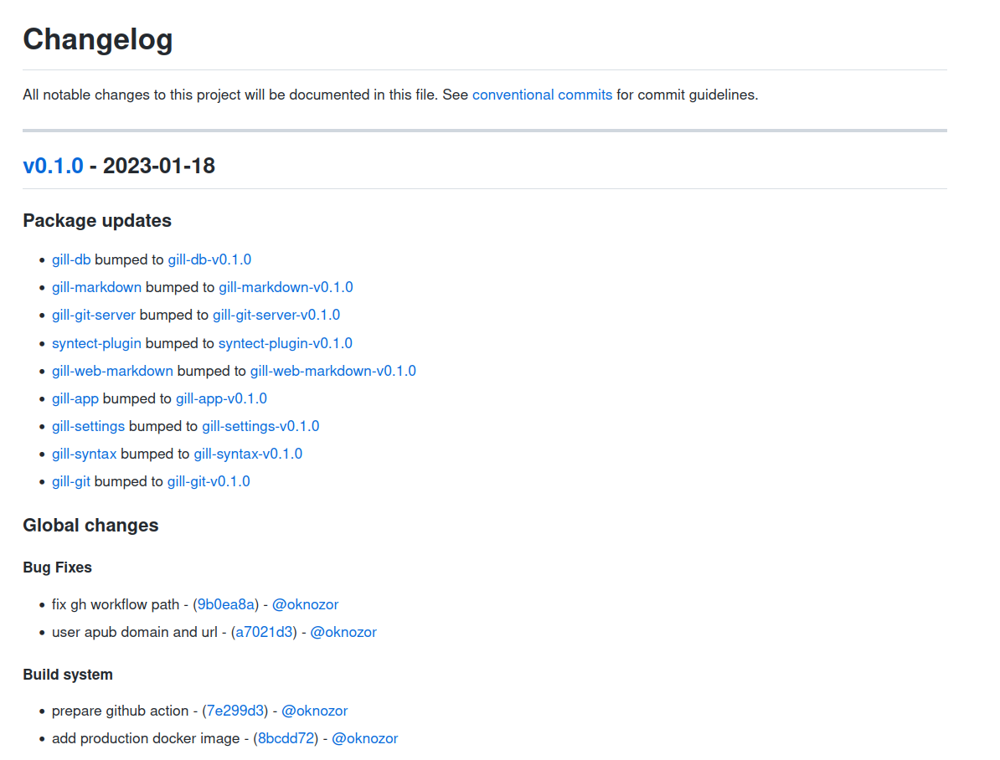
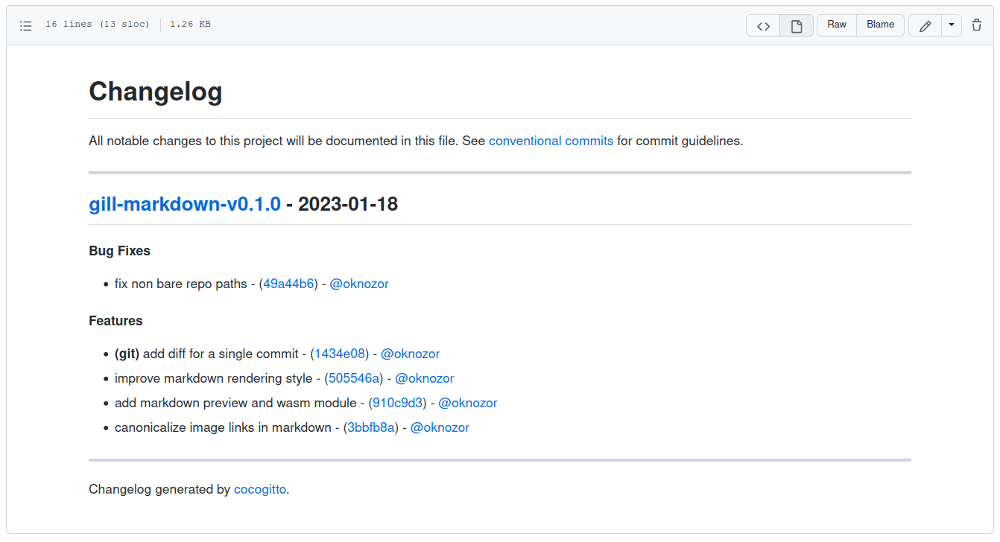

+++
title = "Announcing Cocogitto 5.3.0"
date = 2023-01-20
+++

### Changelog

Changelog for the upcomming 5.3.0 version (generated by Cocogitto)

---

#### Bug Fixes
- ignore merge commits based on parent counts - ([f8b5da6](https://github.com/cocogitto/cocogitto/commit/f8b5da64343e60ce5851e2e25b93611bfcf4db05)) - [@oknozor](https://github.com/oknozor)
- signing for chore commits - ([18b9643](https://github.com/cocogitto/cocogitto/commit/18b9643318cad85bae56a4217b04e3e684650d09)) - [@DaRacci](https://github.com/DaRacci)
#### Documentation
- add cargo-smart-release to the list of similar projects - ([3a04e72](https://github.com/cocogitto/cocogitto/commit/3a04e72231626af9717d4e8476e7e5af9c58a8ce)) - [@oknozor](https://github.com/oknozor)
- report one binary following `coco` deprecation - ([3ad6d28](https://github.com/cocogitto/cocogitto/commit/3ad6d28d2909f7a51ca384408550776a5e9b50be)) -  [@lucatrv](https://github.com/lucatrv)
#### Features
- **(cli)** add subcommand for generating manpages - ([fe6bcfe](https://github.com/cocogitto/cocogitto/commit/fe6bcfe578c00be0ded6463c96c54e7392ee1635)) - [@tranzystorek-io](https://github.com/tranzystorek-io)
- monorepo support ([#240](https://github.com/cocogitto/cocogitto/pull/240)) - ([d8eed3d](https://github.com/cocogitto/cocogitto/commit/d8eed3dc7eac644bf56dd1c4bd4dea0bb1d4f746)) - [@oknozor](https://github.com/oknozor)
- NuShell completions - ([3a356cc](https://github.com/cocogitto/cocogitto/commit/3a356ccb0e5838e5fe09fa56a18842fb417eddd7)) - [@DaRacci](https://github.com/DaRacci)
- add from_latest_tag to settings - ([a154782](https://github.com/cocogitto/cocogitto/commit/a154782639c899fc585b68ea28ce00d2f4bfefb9)) - [@stephenc](https://github.com/stephenc)
#### Miscellaneous Chores
- bump dependencies and fix rustc-serialize cve - ([fc0e129](https://github.com/cocogitto/cocogitto/commit/fc0e129606911fde53b7256c2fda3b408b3484af)) - [@oknozor](https://github.com/oknozor)
- bump clap version to 4.0 - ([dbef47b](https://github.com/cocogitto/cocogitto/commit/dbef47b3fe69c9518dbc5757965c844c37f512fd)) - [@tranzystorek-io](https://github.com/tranzystorek-io)
#### Refactoring
- simplify project structure for binaries - ([941fb10](https://github.com/cocogitto/cocogitto/commit/941fb103453e311fe7a51f5cf9573e73e6ff1e80)) - [@tranzystorek-io](https://github.com/tranzystorek-io)
#### Tests
- hard code init branch to 'master' to avoid conflict with user config - ([d22482e](https://github.com/cocogitto/cocogitto/commit/d22482e4e2406a4db00d76c25cfcc7ea5e1579c2)) - [@oknozor](https://github.com/oknozor)

---

## Thanks

❤️ Kudos to [@stephenc](https://github.com/stephenc), 
[@DaRacci](https://github.com/DaRacci), 
[@lucatrv](https://github.com/lucatrv), 
[@tranzystorek-io](https://github.com/tranzystorek-io) who contributed to the upcomming Cocogitto release ! 

## Mono-repository support

For those who don't know, [Cocogitto](https://docs.cocogitto.io) is a Conventional Commit and 
SemVer swiss army knife. You can create Conventional Commits with the CLI, automatically release new version, enforce the
specifications with the GitHub bot and action etc.

It's been a while since I last worked on it. And it was mainly in maintenance mode. 
But lately I have been working on [Gill](https://github.com/oknozor/gill), an activity pub based git platform. 
It's not ready for production yet, but it is already a big project with a dozen crates in the cargo workspace. 

Unfortunately I was not able to use Cocogitto for this project because of its mono-repository nature. 
The least I could do for a project so closely related to git is to correctly manage versioning, so finally 
decided to tackle mono-repo support in Cocogitto. 

**Global version**

Without further ado here is a sample of the first repository changelog generated by Cocogitto:


As you can see the [automatic bump](https://docs.cocogitto.io/guide/#automatic-versioning) performed by Cocogitto
generated a global changelog and created a tag for each updated crate on the workspace. 
There were no previous tag on the repository so a new version was created for each crate. Subsequent bumps will 
generate a new version only for crates modified since the previous release. 

The mono-repository bump also generate a global project tag. It's calculated based on the generated package tags 
or on the global commits. 

**Per package version**

The bump also generated a new changelog for each updated crate: 



**How to**

Mono-repo support is just a matter of configuration. 
If you have used Cocogitto before, all you need to do is to update your `cog.toml` to declare your monorepo packages. 

Here is a sample of [Gill's configuration](https://github.com/oknozor/gill/blob/main/cog.toml)

```toml
pre_bump_hooks = [
"SQLX_OFFLINE=true cargo test",
"SQLX_OFFLINE=true cargo clippy",
"cargo fmt --all",
"SQLX_OFFLINE=true cargo build --release",
]

post_bump_hooks = [
"git push",
"git push origin --tags",
]

pre_package_bump_hooks = [
"cargo set-version {{version}}"
]

[packages]
gill-app = { path = "crates/gill-app" }
gill-authorize-derive = { path = "crates/gill-authorize-derive", public_api = false }
gill-db = { path = "crates/gill-db", public_api = false }
gill-git = { path = "crates/gill-git", public_api = false }
gill-git-server = { path = "crates/gill-git-server" }
gill-markdown = { path = "crates/gill-markdown", public_api = false }
gill-settings = { path = "crates/gill-settings" }
gill-syntax = { path = "crates/gill-syntax" }
gill-web-markdown = { path = "crates/gill-web-markdown" }
syntect-plugin = { path = "crates/syntect-plugin", public_api = false }
```
- Run per package hooks with `pre_package_bump_hooks`, `post_package_bump_hooks`. 
- Package hooks run with the package path as current directory.
- They can be overridden per package. For instance if all packages are build with `cargo` except for a `npm` frontend. 
  you just need to override the hooks for that package. 
- package declared with `public_api = false` will be bumped but will not affect the calculated global version. 
