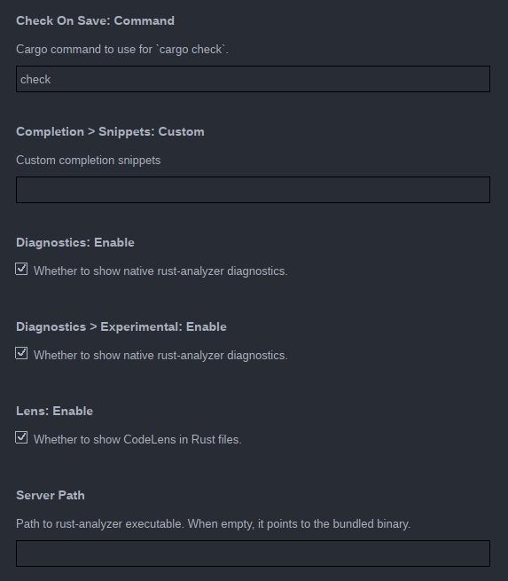

+++
title = "How to write a Lapce plugin"
date = 2022-10-18
+++

This has been asked a lot on the Lapce Discord server so I am going to write a small guide 
on how to write a Lapce LSP plugin. 

## Current state of the plugin ecosystem

Lapce plugin system allow you to create a [wasm](https://webassembly.org/) binary which will be responsible for starting a LSP 
server implementation and dispatch message between Lapce and the LSP server. 

[The Language Server Protocol](https://microsoft.github.io/language-server-protocol/) provides language related features such as autocompletion, 
refactors, code actions etc. 
Currently, **communication with a LSP implementation is the only feature avalaible through Lapce plugins**.
That said, there are ongoing works to provide a LSP superset called [Plugin Server Protocol](https://github.com/lapce/plugin-server-protocol) (PSP).
The goal of PSP is to provide a general abstraction for editor related actions like: launching commands, 
handling settings, drawing plugin UI etc.

## Plugin architechure

Before actually writting a plugin let's review quickly how plugins work under the hood. 

First you can get a global view of the plugin architecture on
[Lacpe official documentation](https://docs.lapce.dev/development/architecture). 

Now that you are familiar  with the general architechure let's zoom a bit on LSP plugins. 

Plugin lifecycle roughly goes like this :
- Lapce starts plugins depending on the current editor file extension. 
- The plugin determine if it needs to download the LSP server implementation. For instance on first launch, 
  The rust plugin will download [rust-analyzer](https://rust-analyzer.github.io/). Once installed the plugin launch
  the LSP server.
- User action in Lapce (ex: typing) will trigger some events, those events will forwarded Lapce proxy, which will 
  translate those event into LSP request if needed (for instance completion requests).
- The LSP plugin respond via stdout, Lapce proxy translate the LSP response into UI changes. 
- So on and so forth.

This might seems a lot, but fortunatly for us the [lapce-plugin](https://github.com/lapce/lapce-plugin-rust) crate does all the heavy lifting for us. 
All we need to do is to provide some plugin settings to lapce and write the LSP implementation installation 
and startup logic. 

## Getting started

Lapce plugin can be written in any language that compiles to wasm architecture, but for the sake of simplicity
we are going to use Rust with the [lapce-plugin](https://github.com/lapce/lapce-plugin-rust) crate. 

Before diving into the actual coding we need to pick a LSP implementation. You probably came here with a 
specific language in mind, to find if there is an LSP implementation available for your language, check 
[the LSP implemenation list](https://microsoft.github.io/language-server-protocol/implementors/servers/). 

For this tutorial we are going to implement Java support via [Eclipse JDTLS](https://github.com/eclipse/eclipse.jdt.ls). 

### Prerequisite

- [Rust](https://www.rust-lang.org/tools/install)
- [Lapce](https://lapce.dev/)
- LSP implementation specifics (For instance here Java)
- A Github account

### Volt template

Internally Lapce plugins are called "volts", I was told that Lapce creator Dongdong Zhou came up with "volt" 
because Lapce is Lightning Fast 🙂.

The [lapce-community](https://github.com/lapce-community) github org host various plugin and also 
provide a template repository to create plugins using Rust.

To get started open [lapce-community/lapce-volt-template](https://github.com/lapce-community/lapce-volt-template/)
and click the "Use this template" button on the repository page. This will create a new repo for your plugin.
You will need to give your repository a name, we are going to name ours `lapce-java`. 

Once you are done clone your repository and open it in Lapce.

## Setting up the environment

When listed on the [official plugin list](https://github.com/lapce/lapce.github.io/blob/master/volts2) you can install Lapce plugins
from the UI. Since we are developping a new plugin we will need to install it manually to test it. 
To install a plugin you need to copy the relevant file to Lapce plugin directory (on linux `$HOME/.local/share/lapce-stable/plugins`) 


### Build script

I personnally like the simplicity of [justfiles](https://github.com/casey/just) so I went for a simple
just script: 

```just
xdg_data_dir :=  "$HOME/.local/share"
plugin_dir := "plugins/oknozor.lapce-java"

build:
    cargo make

install-stable: build
    mkdir -p {{xdg_data_dir}}/lapce-stable/{{plugin_dir}}/bin
    yes | cp -i bin/lapce-java.wasm {{xdg_data_dir}}/lapce-stable/{{plugin_dir}}/bin
    yes | cp -i volt.toml {{xdg_data_dir}}/lapce-stable/{{plugin_dir}}/
    rm -rd {{xdg_data_dir}}/lapce-stable/{{plugin_dir}}/jdt-language-server-latest || true
```

To install the plugin you can now run `just install stable`. If you don't want to use just a simple shell script can do the exact same thing. 
I strongly advise to install the plugin after each step and launch a java project in Lapce to track your progress.

### Debugging

Along the tutorial you might want to debug your plugin, emit log etc. 
Here are the few things you can do to get some informations :

1. Plugin stderr
  You can start lapce in the terminal to inspect plugin log emitted through sdterr. Note that these logs are not emitted with `eprintln!` macro but using `lapce_plugin::PLUGIN_RPC.stderr`: 
    
    ```rust 
    PLUGIN_RPC.stderr(&format!("Oh no!"));
    ```
    
2. Lapce logs
  LSP error will be forwarded to Lapce log file, you can inspect log via lapce pallete commands `>Open Log File` 
  and `>Open Log Directory`


### Changing the plugin metadata

For the plugin to be able to declare itself to Lapce we need to edit 
`volt.toml` and `Cargo.toml` to replace the template plugin name with the correct name. 

1. `Cargo.toml`
      ```toml
      [package]
      edition = "2021"
      name = "lapce-java"
      version = "0.1.0"
      ```

2. `volt.toml
      ```toml
      # volt.toml
      name = "lapce-java"
      version = "0.2.0"
      
      author = "Paul Delafosse <paul.delfafosse@gmail.com>"
      display-name = "Java"
      
      description = "Lapce LSP plugin for java, powered by Eclipse JDT Language Server"
      wasm = "bin/lapce-java.wasm"
      
      [activation]
      language = ["java"]
      workspace-contains = ["*/*.java"]
      ```

See on github: [8a1a278](https://github.com/oknozor/lapce-java/commit/8a1a27840e59fbb7fae47a313080e16b5b010659)

## Implementing the plugin

We are now ready to write the plugin logic. You would be surprise how little we actually have to code. 
For our simple Java plugin, the only logic we need to edit resides in the `initialize` function. 

This function is called by lapce when the "activate"  conditions are met (see `volt.toml`).

### Document selectors

First we need to setup the `DocumentSelector` which will tell Lapce if it should use the LSP server
for a given file extention or a language id: 

```rust
    let document_selector: DocumentSelector = vec![DocumentFilter {
        language: Some(String::from("java")),
        pattern: Some(String::from("**/*.java")),
        scheme: None,
    }];
```

See on github: [1482245](https://github.com/oknozor/lapce-java/commit/1482245404b77776421390658ffcda0e1309f5af)

### Download the LSP server

We need to download our lsp server implementation from [eclipse.org](https://projects.eclipse.org/projects/eclipse.jdt.ls). 

```rust    
    // We are going to extract eclipse jdtls lsp server to this directory
    let jdtls_file_name = "jdt-language-server-latest";
    // This is the dowloaded tar archive name
    let gz_path = PathBuf::from(format!("{jdtls_file_name}.tar.gz"));
    
    // Url to the latest jdtsl server archive
    let url = format!(
        "http://download.eclipse.org/jdtls/snapshots/{}.tar.gz",
        jdtls_file_name
    );

    // If the path does not exists yet we need to download and or extract the server archive
    if !PathBuf::from(jdtls_file_name).exists() {
        // if the tarball does not exist, retrieve it from eclipse.org
        if !gz_path.exists() {
            let mut resp = Http::get(&url)?;
            let body = resp.body_read_all()?;
            std::fs::write(&gz_path, body)?;
        }

        // Extract the tarball to "jdt-language-server-latest"
        let tar_gz = std::fs::File::open(gz_path).unwrap();
        let tar = MultiGzDecoder::new(tar_gz);
        let mut archive = tar::Archive::new(tar);
        let dir = PathBuf::from(jdtls_file_name);
        std::fs::create_dir(&dir)?;
        for (_, file) in archive.entries().unwrap().raw(true).enumerate() {
            let mut entry = file?;
            let entry_type = entry.header().entry_type();
            if !entry_type.is_dir() && !entry_type.is_file() {
                continue;
            }

            let entry_path = dir.join(&entry.path()?);
            if entry_type.is_dir() {
                std::fs::create_dir_all(&entry_path)?;
            } else if entry_type.is_file() {
                let mut outfile = File::create(&entry_path)?;
                std::io::copy(&mut entry, &mut outfile)?;
            }
        }
    }
```

See on github: [5a44c14](https://github.com/oknozor/lapce-java/commit/5a44c1447fea01e04620243e3047df84ee2e878b)

### Plugin settings

Plugins maus expose settings through lapce UI. These could be specific configurations
for the LSP server, path to a custom LSP executable etc. 

For instance the screenshot below illustrate the settings exposed by the Rust plugin.



One thing we definitely want to support in the Java LSP language server is [lombok](https://projectlombok.org/) support. 
It is widely used and lombok code generation is likely to emit tons of error if not supported by our LSP server. 

To display the option in lapce UI we first need to add the setting to our `volt.toml` file: 

```toml
[config."lombok"]
default = false
description = "Enable the lombok java agent"
```

And then parse those param in the `initialize function: 

```rust
    let mut enable_lombok_agent = false;

    if let Some(options) = params.initialization_options.as_ref() {
        if let Some(enable_lombok) = options.get("lombok") {
            enable_lombok_agent = serde_json::from_value(enable_lombok.clone())?;
        }
    // ... etc
    }
```

Then we need to check on start if the lombok jar is present or else download it
and add it to the lsp server parameters: 

```rust
    if enable_lombok_agent {
        let lombok_jar = "lombok.jar";
        let lombok_url = format!("https://projectlombok.org/downloads/{lombok_jar}");

        if !PathBuf::from(lombok_jar).exists() {
            let mut resp = Http::get(&lombok_url)?;
            let body = resp.body_read_all()?;
            std::fs::write(&lombok_jar, body)?;
        }

        let lombok = base_path.join("lombok.jar")?;
        let lombok = lombok.to_file_path().expect("failed to get file path");
        let lombok = lombok.to_string_lossy();
        server_args.push(format!("--jvm-arg=-javaagent:{lombok}"));
    }
```

And that's it, lombok should work with the LSP server now!

See on github: [2a79531](https://github.com/oknozor/lapce-java/commit/2a7953147a7755f1e85204acb8989a91d1ab7247)

## Making a PR to Lapce plugin repository 

Once you have tested your plugin and are happy with the result, you can publish it to Lapce
by making a PR to [lapce/lapce.github.io](https://github.com/lapce/lapce.github.io).

See on github: [lapce.github.io/pull/39/files](https://github.com/lapce/lapce.github.io/pull/39/files)

## Conclusion 

That all for now, if you have suggestion to improve this article please submit a PR to [oknozor/blog](https://github.com/oknozor/blog). 
You can ask for help on Lapce's [Discord server](https://discord.gg/n8tGJ6Rn6D). 

  
