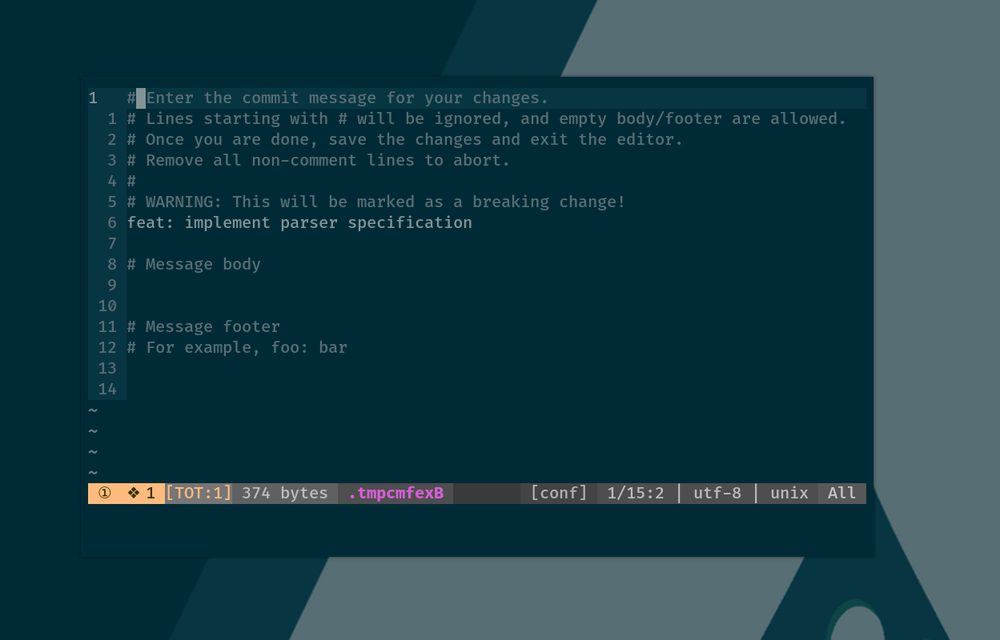
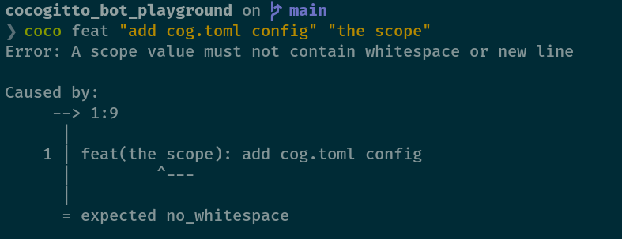
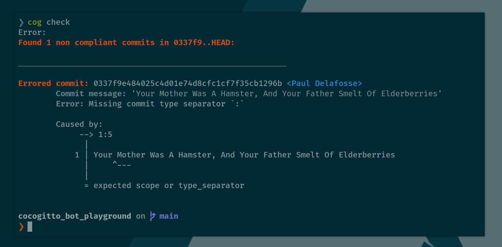
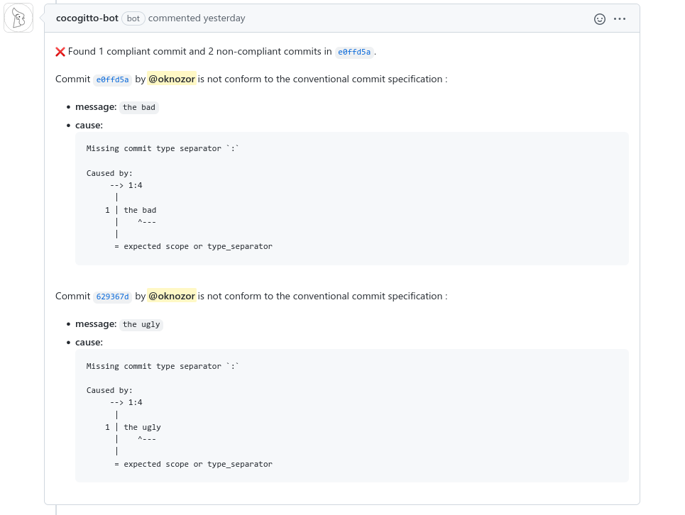
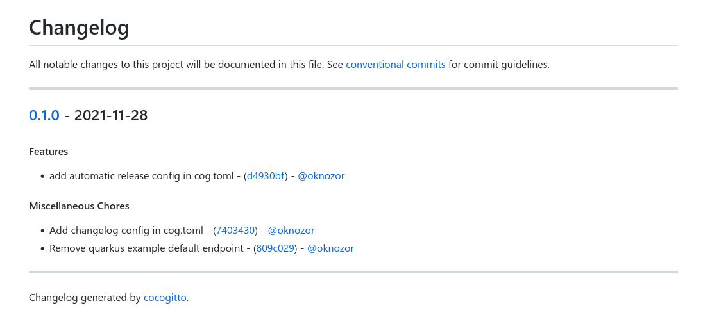
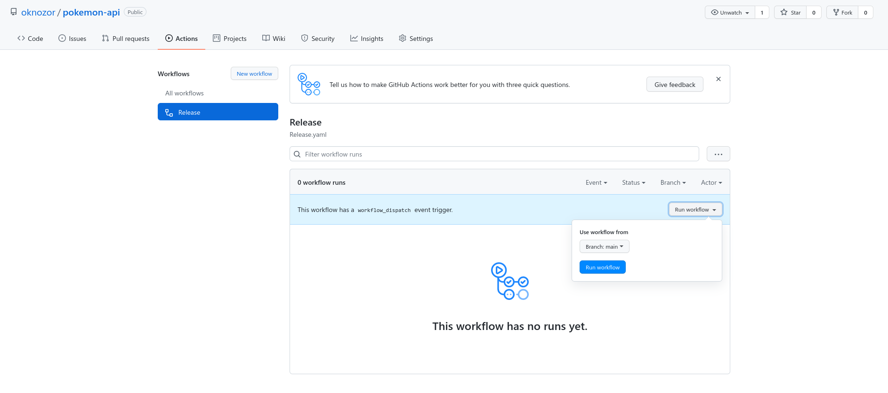
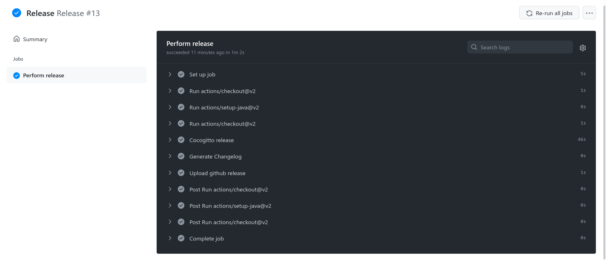

+++
title = "One click away from the next release"
date = 2021-11-26
+++

My first encounter with the [Conventional Commits](https://www.conventionalcommits.org/en/v1.0.0/)
specification occurred during my internship a couple of year ago.
We were using the spec in most of our projects. 

Having dealt before with commit logs polluted with meaningless commit messages such as "test", "fix bug", 
enforcing a commit convention to have a nice human-readable git history felt good. But I soon realised that
we were still missing the point.

At the time I was also learning Rust, so I started a hobby project called [Cocogitto](https://docs.cocogitto.io/), 
a cli to enforce and leverage the specification. 

Today I pleased to release Cocogitto `4.0.0` !  

In this article I will take you through a quick tour of the project and show you how you can automate your SemVer Release with it. 
But before that we need to talk a bit more about the specification itself.
I will assume basic knowledge of both [SemVer](https://semver.org/)
and [Conventional Commits](https://www.conventionalcommits.org/en/v1.0.0/). If you have not read those specs yet
go read them now ! 

## Conventional Commits and SemVer

> *"This convention dovetails with SemVer, by describing the features, fixes, and breaking changes made in commit messages."*

This is probably the most important thing to know about Conventional Commits: it was designed to help you use SemVer.
There are other benefits to use the specification but these are just side effects in my opinion. 

**How does it work ?**

The rule is quite simple actually , If your commit history since the latest tag contains at least one: 
- **bug fix** commit, increment the `PATCH` version.
- **feature** commit, the next version should increment the `MINOR` version number.
- **breaking change** commit, increment the `MAJOR` version number.

**Example:**

Let's look at a chunk of commit history from Cocogitto. 
Here the current version is `3.0.0` in the example above we have a `feat` commit. If we create a version now
it shall be `3.1.0`. Dead simple, actually.

```
* 16cf259 - (HEAD) docs: update readme
* bb07f38 - chore: use MIT license in cargo.toml
* d0a40b6 - ci: update codecov action
* 916adb9 - chore: remove aur package submodule #141
* 1d29e96 - feat(cli): improve commit format error format
* b2ef3aa - fix(bump): fix target changelog tag on bump
```

## Why do we need a commit message convention ?

Ok, I have just been rephrasing the spec at this point, but let us consider this:  

> *The Conventional Commits specification is a lightweight convention on top of commit messages. It provides an easy 
> set of rules for creating an explicit commit history; which makes it easier to write **automated tools** on top of.* 

In other words, there is absolutely no good reason to use Conventional Commits (or any other convention)
if you don't leverage the available tooling to automate repetitive tasks. This is what I meant when saying we were 
missing the point. 

I have seen projects using [Keep a Changelog](https://keepachangelog.com/en/1.0.0/)
without keeping a changelog, conventional Commits without Semver. There are also some crazy people out there
using emoji in commit messages.

Please don't do those things!

Conventional Commits *"makes it easier to write automated tools"* and luckily there are [plenty](https://www.conventionalcommits.org/en/about/).

If you are absolutely sure you don't need a changelog or semantic versioning, you will probably be better off writing
clear and concise commit messages using natural language. 

On the other hand if you do need automation, semantic versioning, 
generated changelogs and all the good stuff. You might want to use Conventional Commits with the proper tooling.

## Introducing Cocogitto

When working on a project with git you create commits locally, push them to a remote repository and package them via some
CI/CI pipelines. 

There is an implicit boundary between where the code is written (your machine) and where the code lives (anywhere else). 
Cocogitto reflect that by being split in two distinct binaries : 
- `coco` which provides everything you need to create conventional commits.
- `cog` containing the tools needed to enforce and leverage the convention.

Before going further we will take a quick tour of the project capabilities.
Note that this is just a quick intro, if you want an in depth guide you can check the [official documentation](https://docs.cocogitto.io/).  

### Creating conventional commits

`coco` as a set of subcommands matching the Conventional Commits and [Angular commits types](https://github.com/angular/angular/blob/22b96b9/CONTRIBUTING.md#-commit-message-guidelines).
You can add new subcommands in a config file named `cog.toml` in your repository if needed. 

**How do I create a commit ?**

```bash
coco feat "implement parser specification"
# -> 'feat: implement parser specification'
```

**What if we need a commit scope ?** 

```bash
coco feat "implement parser specification" parser
# -> 'feat(parser): implement parser specification'
```

Note how the scope is provided after the message, it might seem unintuitive, but I decided I wanted as few flags as possible
in the command line. 

**Ok, I want a breaking change commit now.**
```bash
coco feat -B "implement parser specification"
# -> 'feat!(parser): implement parser specification'
```

**I need to write a conventional commit message with body and footers**
```bash
coco feat -B -e "implement parser specification"
# -> 'feat!(parser): implement parser specification'
```

The `-e` flag will open an editor prefilled with the entered commit summary :



**What if I still make some mistakes ?**

If you are an expert conventional committer, at this point you might think the CLI design still permit mistake regarding
the convention. Well if you happen to make a mistake `coco` will produce an error explaining why your message does not
respect the convention: 



Now that we took a quick tour of `coco`, let's take a look at `cog` which does all the heavy lifting.

### Enforcing the specification

Creating conventional commits locally is fine but what if the other people working on the project do not use `coco` ?
What if I am a clumsy committer and make mistake all the time ?

There are a multiple ways Cocogitto can help you with that: 
- the `check` subcommand to validate your commit log. 
- the `install-hook` subcommand to generate `pre-push` and `commit-msg` [git-hooks](https://git-scm.com/book/en/v2/Customizing-Git-Git-Hooks).
- [cocogitto-action](https://github.com/cocogitto/cocogitto-action) run these checks on your CI
- [cocogitto-bot](https://github.com/apps/cocogitto-bot) check your PR and let your contributors know when they made a mistake.

**How do I validate my commit history locally?**



**How do I install git-hooks ?**

```bash
cog install-hook pre-push
cog install-hook pre-commit
```

**How do I use this in my CI pipeline?**

Currently, Cocogitto support GitHub action only, but I am planning to add Gitlab CI and Azure DevOps integration soon. 

```yaml
  - uses: actions/checkout@v2
    with:
      fetch-depth: 0
      
  - name: Conventional Commits check
    uses: cocogitto/cocogitto-action@main
    with:
      check-latest-tag-only: true
```

**A GitHub bot You said?**

[Cocogitto-bot](https://github.com/apps/cocogitto-bot) will check every commit on your pull-request.
It is free of charge and will remain so for public open-source repository. So go ahead and try it ! 



### The one click release

So far I have been throwing examples and screenshots without giving much context.
I hope you want to try Cocogitto already, but the interesting part actually starts here. 

Creating and validating commits is great, but not useful in itself. 
As we saw earlier the purpose of the specification is to automate version increments and changelogs generation.
This is exactly what we are going to do know. 

In a first part we will set up everything needed to perform automatic version bump from your local machine. 
Once we are familiar with how it is done we will set up the GitHub action to create version in one click. 

#### Local bump

What are the steps we go through when creating releases manually ? 

It probably looks somehow close to this: 
1. Increment a version number in your package manifest (`pom.xml`, `Package.json`, `Cargo.toml`, `go.mod`...)
2. Create a version commit: `git commit -m "chore(version): bump version to 1.1.0"`
3. Tag this commit: `git tag 1.1.0`
4. Push everything to remote: `git push`
5. Our continuous delivery pipeline detect the tag and perform the following:
    - build some artifacts, create a GitHub release
    - upload the artifact 
    - ...  
6. Maybe bump the manifest with some pre-release metadata

When using Conventional Commits and Cocogitto automating this is a piece of cake.

##### Example

To demonstrate how it's done we will use [pokemon-api](https://github.com/oknozor/pokemon-api), a toy
project made solely for demonstration purpose.
We don't really care about the actual code here,
it is a Java project built with maven and that is all you need to know. 

The first thing we need to do is to tell Cocogitto what we want to do before and after tagging the release.
This is done via the `cog.toml` config file : 

```toml
pre_bump_hooks = [
    """
        sh -c "./ci/ensure_on_branch_main.sh"
    """,
    "mvn package -q",
    "mvn versions:set -DnewVersion={{version}}",
]

post_bump_hooks = [
    "git push",
    "git push origin {{version}}",
]
```

Note that we added a little shell script called `ensure_on_branch_main.sh` to verify we are not bumping from a feature
branch, it looks like this : 

```bash
#!/bin/sh

CURRENT_BRANCH=$(git rev-parse --abbrev-ref HEAD)

if [ "$CURRENT_BRANCH" != "main" ]
then
    echo "Needs to be on main to bump current version"
    exit 1
fi
```

Let us now review this config in detail:
- `pre_bump_hooks` contains an array of shell commands to run before performing the release.
- `post_bump_hooks` are run after the release tag has been created. 
- On pre-hooks success, Cocogitto will generate a changelog, create a release commit, tag it and 
  then run the post-bump hooks. 
  
Let's examine the commands.

**Pre-bumps:**

1. `sh -c "./ci/ensure_on_branch_main.sh"`: ensure we are running the automatic bump on branch `main`.
2. `mvn package -q`: build our project and run the tests. 
3. `mvn versions:set -DnewVersion={{version}}`: increment the package manifest. The `{{version}}` variable will be replaced
   with our target version.

**Post-bumps:**

1. `git push`: push the generated release commit to remote
2. `git push origin {{version}}`: push the generated tag to remote. 

We are almost ready to release but there is one more thing we can do.
Cocogitto will generate a changelog during the release process, we need to tell 
it how to generate markdown links to commits, tags and GitHub users. 

```toml
[changelog]
# The git platform our project is hosted on
remote = "github.com"
# The repository owner on GitHub
owner = "oknozor"
# The repository name on GitHub
repository = "pokemon_api"
# One of Cocoggito built-in changelog template (possible values are "simple", "full_hash" and "remote"
template = "remote"
# A list of commit authors with their git signature and GitHub username
authors = [
    { signature = "Paul Delafosse", username = "oknozor" }
]
```

Alright we are ready now, let's take a look at our project git log before creating our first release : 

```
* 7403430 - (HEAD -> main, origin/main) chore: Add changelog config in cog.toml
* 809c029 - chore: Remove quarkus example default endpoint
* d4930bf - feat: add automatic release config in cog.toml
* 3d4874c - chore: Initial commit
```

Since there is no version published yet, we should bump from `0.0.0` to `0.1.0` :

```
❯ cog bump --auto                              
Failed to get current version, falling back to 0.0.0
Skipping irrelevant commits:
        - chore: 2

Found feature commit d4930b
[INFO] Scanning for projects...
[INFO] 
[INFO] --------------------< org.pokemon.api:pokemon-api >---------------------
[INFO] Building pokemon-api 1.0.0-SNAPSHOT
[INFO] --------------------------------[ jar ]---------------------------------
[INFO] 
[INFO] --- versions-maven-plugin:2.8.1:set (default-cli) @ pokemon-api ---
Downloading from central: https://repo.maven.apache.org/maven2/commons-collections/commons-collections/3.2/commons-collections-3.2.pom
Downloaded from central: https://repo.maven.apache.org/maven2/commons-collections/commons-collections/3.2/commons-collections-3.2.pom (0 B at 0 B/s)
...
[INFO] Local aggregation root: /home/okno/_Workshop/MyRepos/pokemon_api
[INFO] Processing change of org.pokemon.api:pokemon-api:1.0.0-SNAPSHOT -> 0.1.0
[INFO] Processing org.pokemon.api:pokemon-api
[INFO]     Updating project org.pokemon.api:pokemon-api
[INFO]         from version 1.0.0-SNAPSHOT to 0.1.0
[INFO] 
[INFO] ------------------------------------------------------------------------
[INFO] BUILD SUCCESS
[INFO] ------------------------------------------------------------------------
[INFO] Total time:  4.329 s
[INFO] Finished at: 2021-11-28T11:04:05+01:00
[INFO] ------------------------------------------------------------------------
Enumerating objects: 6, done.
Counting objects: 100% (6/6), done.
Delta compression using up to 12 threads
Compressing objects: 100% (4/4), done.
Writing objects: 100% (4/4), 817 bytes | 817.00 KiB/s, done.
Total 4 (delta 2), reused 0 (delta 0), pack-reused 0
remote: Resolving deltas: 100% (2/2), completed with 2 local objects.
To github.com:oknozor/pokemon-api.git
   7403430..3f0829a  main -> main
Total 0 (delta 0), reused 0 (delta 0), pack-reused 0
To github.com:oknozor/pokemon-api.git
 * [new tag]         0.1.0 -> 0.1.0
Bumped version: ... -> 0.1.0
cog bump --auto  29.84s user 2.07s system 219% cpu 14.530 total
```

As you can see everything ran smoothly, we have our tag : 

```
* 3f0829a - (HEAD -> main, tag: 0.1.0, origin/main) chore(version): 0.1.0
```

And a changelog has be generated : 


From now on, we can repeat this indefinitely. As long as our commit messages are Conventional Commits compliant, 
we won't have to care about version number or editing changelogs anymore.

Not only cool because we have just automated a boring and repetitive task, but also `cog.toml` is documenting our
git flow. You can adapt the config to build a docker image and deploy it, make sure your main branch is up-to-date with 
another one, deploy a static website etc.

#### The one click release

Creating release from our local machine might be enough for small projects, but it's not ideal.

Your build might succeed on your local machine but fail on the target environment, maybe you just want to make a statement
by showing it to the world ? Or you are not working alone on your project ?  

Actually there are plenty of reasons to build your project remotely, and we are not going to list them all. 

Let us turn our toy project release config into a one click CI/CD pipeline: 

```yaml
# .github/workflows/Release.yaml
name: Release

on:
  workflow_dispatch:
    branches: main

jobs:
  release:
    runs-on: ubuntu-latest
    name: Perform release

    steps:
      - uses: actions/checkout@v2
      with:
        fetch-depth: 0 # mandatory to get the full git history
      - uses: actions/setup-java@v2
        with:
          distribution: 'temurin'
          java-version: '17'

      - name: Cocogitto release
        id: release
        uses: cocogitto/cocogitto-action@v2.1
        with:
          release: true
```

Notice the `workflow_dispatch` attributes, it adds a "Release" button to the repository action page :



We can now perform a release just by clicking the release button : 



That it, a [tag](https://github.com/oknozor/pokemon-api/commit/153ca762a72b7a4e2345f1316cbc1fa44bbd0f1e) was made, 
the [changelog](https://github.com/oknozor/pokemon-api/blob/main/CHANGELOG.md) has been updated, our next release 
is just one click away.

## Conclusion

This concludes our quick introduction to Cocogitto I hope you will consider giving it a shot.

Cocogitto is free and open-source and thrives thanks to its contributors, if you have any question please let us
know on the Github [issue tracker](https://github.com/cocogitto/cocogitto/issues)
or on the chat room [#cocogitto:matrix.org](https://matrix.to/#/#cocogitto:matrix.org).  

Last but no least you can [buy me a coffee](https://github.com/sponsors/oknozor). 


