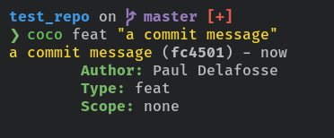
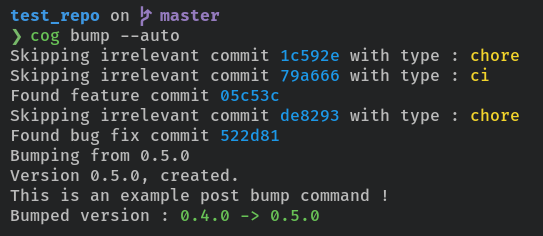
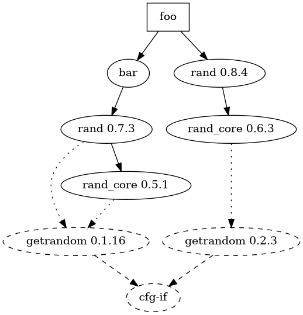
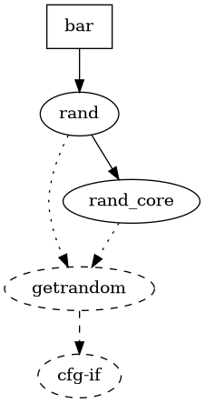

+++
title = "Optimize Rust binaries size with cargo and Semver"
date = 2021-09-19
+++

## A bit of context

These past days I worked a lot on [Cocogitto](https://github.com/oknozor/cocogitto)'s next version. 
Cocogitto is a tool I started to write about two years ago to automate SemVer bumps and ease conventional commits creation.
I won't explain in detail here what Cocogitto does so check it out ! All you have to know for now is that Cocogitto has 
two binaries: 
- `coco` to create conventional commits like this.
    
  
- `cog` which allow you to create version automatically based on your conventional commit history.
    

There is a lot more to it, but this is beyond the scope of this post.

Few weeks ago I created a [GitHub action](https://github.com/oknozor/cocogitto-action) that downloads the binaries,
verify your commit history compliance with the conventional commit specification. Additionally, the action allow you 
to automate releases. 

Before that I was not too interested in reducing the size of the two binaries. 

Now that I use this mechanism an HTTP call is made on every push to the repos using cocogitto's GitHub action to 
download the binaries, perform the required checks and/or perform a release. Having the smallest possible binary 
is now a must to speed up all CI pipelines using Cocogitto.

## Getting started 

I had read some blog post about rust binary size optimization before, but never tried to actually do it. 
Prior to any optimization, the size of our binaries was the following: 
- `coco`: **5.1M** 
- `cog`: **5.7M** 

Ouch! About 11 Megabytes for two binary, that's a lot. In comparison, let us examine some first grade CLIs apps:
 - `git` **3.4M**
 - `bat` **4.6M**
 - `rustup` **8M**

Feature wise, `cog` and `coco` are way smaller than those tools. 
There must be room for improvement !  

Fortunately there are plenty of blog posts and rust books out there. I recommend reading the following article
which describe the primary goals of cargo designs. It might not seem relevant yet, but it will 
become crystal clear by the end of this post:

> *"Cargo is not just a dependency manager, but Rust's primary workflow tool."*
>
> From the Rust lang blog: [predictable dependency management](https://blog.rust-lang.org/2016/05/05/cargo-pillars.html)

## Cargo optimizations

I did some research and found [a blog post by arusahni](https://arusahni.net/blog/2020/03/optimizing-rust-binary-size.html)
and [the build configuration chapter](https://nnethercote.github.io/perf-book/build-configuration.html?highlight=lto#link-time-optimization)
in the rust performance book. 

Let's get to it !

### Optimization level

Compile time optimization can be achieved by tweaking your `Cargo.toml` release profile.
For an exhaustive list of available option checkout [the cargo reference](https://doc.rust-lang.org/cargo/reference/profiles.html).

The `opt-level` attribute control the level of optimization performed by rustc. 

As stated in the Cargo book: *"It is recommended 
to experiment with different levels to find the right balance for your project. There may be surprising results, 
such as level 3 being slower than 2, or the "s" and "z" levels not being necessarily smaller. You may also want to 
reevaluate your settings over time as newer versions of rustc changes optimization behavior."* 

Before we start tweaking our `Cargo.toml` keep in mind that our goal is only to reduce the released binaries size. 
In the process compile time might increase, unfortunately we can't have the cake and eat it too. That said, for the sake
of information, we will still inspect the build time before and after optimizing the binaries size.

To do this we can run `cargo build` with the following flags : 

```bash
cargo +nightly build -Z timings --release
```

<iframe id="zbuild-no-opt"
    title="Build time report generated by cargo"
    width="100%"
    height="800"
    src="../images/rust_binary_size/cargo-timing-no-opt.html">
</iframe>

Remember we started from the following sizes:
- `coco`: **5.1M**
- `cog`: **5.7M**
  
So let us try those optimizations levels !

___
**Level `s`:**

```toml
[profile.release]
opt-level = "s"
```
Binaries size:
- `coco`: **5.3M**
- `cog`: **5.9M**

`s` optimization level produce slightly heavier binaries, next ! 

---
**Level `z`:**

```toml
[profile.release]
opt-level = "z"
```

Binaries size:
- `coco`: **5.5M**
- `cog`: **6.2M**

This is getting worse ! 

---
**Level `1`:**

Binaries size:
- `coco`: **9.4M**
- `cog`: **12M**

No way ! 

---
**Level `2`:**

Binaries size:
- `coco`: **5.1M**
- `cog`: **5.7M**

Okay, this is the default optimization level.

---
**Level `3`:**

Binaries size:
- `coco`: **5.1M**
- `cog`: **5.7M**

Exactly like level `2`, we made no progress here... 

---

Let's jump to the next optimization flag, we might want to 
retry switching between `2` and `3` when other optimization will be set. 

### Link time optimization

The link time optimization flag controls how the LLVM backend will try to optimize the binary. This comes at the cost 
of longer linking time. I don't really care about build time, so we can go for the full LTO which will perform optimization
for all crates used in the project.

---
```toml
[profile.release]
opt-level = 3
lto = "fat"
```

Binaries size:
- `coco`: **3.0M**
- `cog`: **3.8M**
---

Here we are ! We made some real improvement here. I did not measure compile time yet, but I did not notice a huge 
difference either.

Now let us try to switch to `opt-level 2` again: 

--- 
```toml
[profile.release]
opt-level = 2
lto = "fat"
```

Binaries size:
- `coco`: **2.9M**
- `cog`: **3.7M**
---
This is even  better, I am going to stick to this and try the next optimization flag. 

### Codegen unit

The `codegen-units` attribute controls how much of the crate will be compiled in parallel. 
The more codegen units the less compile time will be. To reduce the binaries size we need the smallest possible
value here: 

---
```toml
[profile.release]
opt-level = 2
lto = "fat"
codegen-units = 1
```

Binaries size:
- `coco`: **2.6M**
- `cog`: **3.6M**
---

We are getting there. Something puzzled me a bit though, the cargo book state that *"No LTO is performed if codegen 
units is 1 or opt-level is 0."*. That does not seem to be true, I did some test removing `lto = "fat"` or setting
`codegen-units = 2`, in both scenario I ended up with much bigger binaries. I might need to ask on the Rust discord
channel to understand what is going on here. 

Anyway the binaries are getting smaller. 

Now let's take a look again at the `cargo -Z timing` report :

<iframe id="zbuild-no-opt"
title="Build time report generated by cargo"
width="100%"
height="800"
src="../images/rust_binary_size/cargo-timing-opt-level-2-lto-fat-codegen-1.html">
</iframe>

As you can see the build is already about 5 seconds longer than it was without any optimization. 

I can live with that ! 

### Don't panic, abort

Cargo allow you to completely disable stack unwinding and simply abort on panic. 
If you are not familiar with the concept of stack unwinding you could probably read 
[this blog post](https://lucumr.pocoo.org/2014/10/30/dont-panic/) by Armin Ronacher. 

Disabling panic is probably not something I should do but since we are experimenting here, 
let's be greedy and go all the way down ! 

---
```toml
[profile.release]
opt-level = 3
lto = true
codegen-units = 1
panic = "abort"
```

Binaries size:
- `coco`: **2.6M**
- `cog`: **3.3M**
---

We went from a total of **11.8 Megabytes** to **5.9 Megabytes** and all of this without changing a single line of code. 
It is already quite an improvement but there is more we can do. 

## The duplicate crate problem

Cargo is loved by rustaceans and acknowledged to be one of the best package manager out there, if not the best. 
I think the way cargo handle dependencies has a lot to do with it. I use java at work and even if I have much respect 
for maven developers, considering the size of the ecosystem and the age of Java, maven  
does not match the predictability simplicity of cargo.

I started to think about optimizing Cocogitto dependencies because of two things I did before:
1. I moved the code responsible for the conventional
   commits parsing to a dedicated crate ([conventional_commit_parser](https://crates.io/crates/conventional_commit_parser)).
2. I created a fork of the abandoned [spectral](https://github.com/cfrancia/spectral) which I used to write fluent 
   assertions in the Cocogitto test harness, It is called [speculoos](https://github.com/oknozor/speculoos) (yes like
   the belgian spiced shortcrust biscuit)

Turns out the parser crate was still using spectral, in the end my dev build contained both the assertion libraries
which are almost identical but have different names. This was trivial to resolve. I just needed to update the
parser to use my spectral fork, but I started to wonder: what if I have the dependencies `foo = 1.0.0` and `bar = 2.0.0`
in my project and foo depends on `bar = 1.0.0` ? 

Well other package manager would fail in such situation, but cargo is clever, too clever I should say !
Stephen Coakley wrote an [article](https://stephenécoakley.com/2019/04/24/how-rust-solved-dependency-hell) describing 
precisely what happen in such situation. To sum up, in cases where cargo is not able to select a unique version for a 
crate in your project, it will use [name mangling](https://en.wikipedia.org/wiki/Name_mangling) to make both versions
coexist. 


### Example 

Let's now create a simple example to see what exactly is happening here and how it will impact our binary size. 

First we create the binary `foo` and the library `bar`: 

```bash
~/_Workshop/playground
❯ cargo new --bin foo
     Created binary (application) `foo` package

~/_Workshop/playground
❯ cargo new --lib bar
     Created library `bar` package
```

Then let us set the `foo` dependencies in `Cargo.toml`
```toml
[dependencies]
bar = { path = "../bar" }
rand = "0.8.4"
```

And make `bar` depend on an older version of `rand`:
```toml
[dependencies]
rand = "0.7.0"
```

Now we write a dummy main function in `foo`: 
```rust
use rand::Rng;

fn main() {
    let mut rng = rand::thread_rng();
    let number: f64 = rng.gen();
    println!("A random number generated with rand 0.8.4: {}", number);
}
```

Nothing too complicated here but there is something interesting, we set the `bar` as a dependency 
but did not actually use it. 

To see what is happening here we will need some extra tools: 
- [cargo-depgraph](https://sr.ht/~jplatte/cargo-depgraph/): Creates dependency graphs for cargo projects using cargo metadata and graphviz.
- [cargo-bloat](https://github.com/RazrFalcon/cargo-bloat): Find out what takes most of the space in your executable.
- `cargo tree`: A cargo subcommand that display a tree visualization of a dependency graph. 

We will now get the dependency graph for `foo`: 
```bash
foo on master 📦 v0.1.0 via ⚙️ v1.55.0 
❯ cargo depgraph | dot -Tpng > graph.png
```

As you can see below, we have two distinct versions of `rand` coexisting in the crate.
It's even worse than it seemed at first: those dependencies bring their own duplicate dependencies.



Now let us run `cargo-bloat` and see what happens: 
```bash
foo on master 📦 v0.1.0 via ⚙️ v1.55.0 
❯ cargo bloat --crates --release 
   Compiling bar v0.1.0 (/home/okno/_Workshop/playground/bar)
   Compiling foo v0.1.0 (/home/okno/_Workshop/playground/foo)
    Finished release [optimized] target(s) in 0.47s
    Analyzing target/release/foo

File  .text     Size Crate
6.0%  92.2% 204.5KiB std
0.3%   4.0%   8.9KiB rand_chacha
0.1%   0.9%   2.0KiB getrandom
0.0%   0.7%   1.6KiB rand
0.0%   0.1%     230B [Unknown]
0.0%   0.1%     219B rand_core
0.0%   0.1%     185B foo
0.0%   0.0%      68B ppv_lite86
6.5% 100.0% 221.9KiB .text section size, the file size is 3.3MiB

Note: numbers above are a result of guesswork. They are not 100% correct and never will be.
```

This is strange, we cannot see the duplication here, maybe `cargo-bloat` does not take name mangling into account
and merge the size of both rand versions in one line ? 

Let's try something different. We will actually add some code to `bar` and call it in `foo`: 

```rust
use rand::Rng;

/// Function in `bar`
pub fn random_f64() -> f64 {
    let mut rng = rand::thread_rng();
    rng.gen()
}
```

```rust
use rand::Rng;

// Foo's main function
fn main() {
    let mut rng = rand::thread_rng();
    let number: f64 = rng.gen();
    println!("A random number generated with rand 0.8.4: {}", number);

    // Call to the `bar` crate
    let number_from_bar = bar::random_f64();
    println!("A random number generated with rand 0.7.0: {}", number_from_bar);
}
```

Okay now `foo` actually uses bar, let us run `cargo-bloat` again: 
```bash
foo on master 📦 v0.1.0 via ⚙️ v1.55.0 
❯ cargo bloat --crates --release 
   Compiling foo v0.1.0 (/home/okno/_Workshop/playground/foo)
    Finished release [optimized] target(s) in 0.33s
    Analyzing target/release/foo

File  .text     Size Crate
6.0%  87.0% 204.7KiB std
0.5%   7.5%  17.8KiB rand_chacha
0.1%   1.9%   4.4KiB getrandom
0.1%   1.0%   2.4KiB rand
0.0%   0.2%     551B bar
0.0%   0.2%     438B rand_core
0.0%   0.1%     273B foo
0.0%   0.1%     230B [Unknown]
0.0%   0.0%      68B ppv_lite86
6.9% 100.0% 235.3KiB .text section size, the file size is 3.3MiB

Note: numbers above are a result of guesswork. They are not 100% correct and never will be.
```

Did you notice what happened ? 

When we were not using code from `bar`, `rand_chacha` took 8.9 KiB and about 4.0% of the total binary size. 
Now that we call the code it takes 17.8 KiB, 7.5% of the binary size. My guess is that rustc does not include
unused dependencies in the final binary.

Our first assumption was partially true: 
- `cargo-bloat` does not take name mangling into account and merge the size of both rand versions, correct.
- But our first binary  did not include both `rand` version because `bar -> rand 0.7.0` was not used. 

Now that we have successfully bloated our crate with two version of `rand` how do we solve this ? 
The most obvious solution is to manually set `foo` and `bar` `rand` version to `0.8.4`. 
This, of course works, but is not the most efficient. On a real life application with a dozen of dependencies we might have
multiple crates needing the same dependencies, this would work only partially.
Except for `rand`, I own all the crates here. In a real life scenario I would not be able to select
what version of a particular sub-dependency will be needed. 

Cargo like composer and other package managers uses the semver specification to select dependencies. 
This is our way out: SemVer defines a set of requirement that can be applied to a dependencies, these can be found 
on the [cargo reference](https://doc.rust-lang.org/cargo/reference/specifying-dependencies.html). 

Let's try to change the `foo` dependencies, so cargo picks the same `rand` version as bar:
```toml
[dependencies]
bar = { path = "../bar" }
rand = "^0.7" # caret requirement: >=0.7.0, <0.8.0
```

Let us create a new dependency graph: 



Hooray it is fixed !

We will try to apply this knowledge to a real life (part-time/hobby) project.   

## Removing cocogitto's duplicates

Back to our project: this is not a foo/bar hello world example, and I am not sure if we will be able to apply what we just 
learned. Well, nothing ventured, nothing gained!

Here are the current dependencies and profile optimizations set in `Cargo.toml` : 

```toml
[profile.release]
opt-level = 2
lto = "fat"
codegen-units = 1
panic = "abort"

[dependencies]
git2 = { version = "^0", default-features = false, features = [] }
anyhow = "^1"
colored = "^2"
chrono = "^0"
config = "^0"
itertools = "^0"
serde_derive = "^1"
serde = "^1"
tempfile = "^3"
semver = "^0"
shell-words = "^1"
which = "^4"
lazy_static = "^1"
toml = "^0"
structopt = { version = "^0", optional = true }
conventional_commit_parser = "^0"

[dev-dependencies]
assert_cmd = "1.0.3"
predicates = "1"
rand = "0.7.3"
indoc = "1.0.3"
speculoos = "0.7.0"
```

Now let us inspect duplicate crates : 
```
❯ cargo tree --duplicates 
getrandom v0.1.16
├── rand v0.7.3
│   [dev-dependencies]
│   └── cocogitto v3.0.0 (/home/okno/_Workshop/MyRepos/cocogitto)
└── rand_core v0.5.1
    ├── rand v0.7.3 (*)
    └── rand_chacha v0.2.2
        └── rand v0.7.3 (*)

getrandom v0.2.3
└── rand_core v0.6.3
    ├── rand v0.8.4
    │   └── tempfile v3.2.0
    │       └── cocogitto v3.0.0 (/home/okno/_Workshop/MyRepos/cocogitto)
    └── rand_chacha v0.3.1
        └── rand v0.8.4 (*)

num-traits v0.1.43
└── serde-hjson v0.9.1
    └── config v0.11.0
        └── cocogitto v3.0.0 (/home/okno/_Workshop/MyRepos/cocogitto)

num-traits v0.2.14
├── chrono v0.4.19
│   └── cocogitto v3.0.0 (/home/okno/_Workshop/MyRepos/cocogitto)
├── float-cmp v0.8.0
│   └── predicates v1.0.8
│       [dev-dependencies]
│       └── cocogitto v3.0.0 (/home/okno/_Workshop/MyRepos/cocogitto)
├── num v0.1.42
│   └── speculoos v0.7.0
│       [dev-dependencies]
│       └── cocogitto v3.0.0 (/home/okno/_Workshop/MyRepos/cocogitto)
├── num-bigint v0.1.44
│   ├── num v0.1.42 (*)
│   └── num-rational v0.1.42
│       └── num v0.1.42 (*)
├── num-complex v0.1.43
│   └── num v0.1.42 (*)
├── num-integer v0.1.44
│   ├── chrono v0.4.19 (*)
│   ├── num v0.1.42 (*)
│   ├── num-bigint v0.1.44 (*)
│   ├── num-iter v0.1.42
│   │   └── num v0.1.42 (*)
│   └── num-rational v0.1.42 (*)
├── num-iter v0.1.42 (*)
├── num-rational v0.1.42 (*)
└── num-traits v0.1.43 (*)

predicates v1.0.8 (*)

predicates v2.0.2
└── assert_cmd v1.0.8
    [dev-dependencies]
    └── cocogitto v3.0.0 (/home/okno/_Workshop/MyRepos/cocogitto)

rand v0.4.6
└── num-bigint v0.1.44 (*)

rand v0.7.3 (*)

rand v0.8.4 (*)

rand_chacha v0.2.2 (*)

rand_chacha v0.3.1 (*)

rand_core v0.5.1 (*)

rand_core v0.6.3 (*)

serde v0.8.23
└── serde-hjson v0.9.1 (*)

serde v1.0.130
├── cocogitto v3.0.0 (/home/okno/_Workshop/MyRepos/cocogitto)
├── config v0.11.0 (*)
├── serde_json v1.0.67
│   └── config v0.11.0 (*)
└── toml v0.5.8
    ├── cocogitto v3.0.0 (/home/okno/_Workshop/MyRepos/cocogitto)
    └── config v0.11.0 (*)
```

Damn it! I expected some duplications but this is a lot. Multiple versions of `serde`, `num-traits`, and `rand`... 

How to we solve this ? 

Let's not dive into tweaking the SemVer caret requirements, there is something we need to pay attention to : 
Some listed duplicates have the `[dev-dependencies]` profile. Actually having duplicates in our test/dev build is not
such a big deal.

`cargo tree` will have those filtered out :

```
❯ cargo tree --duplicates -e=no-dev            
num-traits v0.1.43
└── serde-hjson v0.9.1
    └── config v0.11.0
        └── cocogitto v3.0.0 (/home/okno/_Workshop/MyRepos/cocogitto)

num-traits v0.2.14
├── chrono v0.4.19
│   └── cocogitto v3.0.0 (/home/okno/_Workshop/MyRepos/cocogitto)
├── num-integer v0.1.44
│   └── chrono v0.4.19 (*)
└── num-traits v0.1.43 (*)

serde v0.8.23
└── serde-hjson v0.9.1 (*)

serde v1.0.130
├── cocogitto v3.0.0 (/home/okno/_Workshop/MyRepos/cocogitto)
├── config v0.11.0 (*)
├── serde_json v1.0.67
│   └── config v0.11.0 (*)
└── toml v0.5.8
    ├── cocogitto v3.0.0 (/home/okno/_Workshop/MyRepos/cocogitto)
    └── config v0.11.0 (*)
```

It is not perfect but much better already. There is one more thing we can check before trying the SemVer approach.

The first obvious issue I see here is `config 0.11.0` needing `serde-hjson` sub-crates which brings an older version
of `serde` in scope. I have no idea what `serde-hjson` is. I might not need that at all. 

Remember `cargo depgraph` ? We will take a look at it outputs before going further: 
```bash
cargo depgraph --build-deps | dot -Tpng > graph.png
```

<iframe id="zbuild-no-opt"
title="cocogitto dependency graph"
width="100%"
height="300"
src="../images/rust_binary_size/graph-cocogitto.png">
</iframe>

Well this is not pretty, but this is useful. The [cargo-depgraph documentation](https://lib.rs/crates/cargo-depgraph) 
states the following : *"dotted lines = optional dependency (could be removed by disabling a cargo feature)"*, `serde-hjson` is one of them.

The default `config` features are the following : `toml`, `json`, `yaml`, `hjson`, `ini`. Cocogitto configurations files
are made of Toml only. Let us disable those and see how it goes : 

```toml
config = { version = "^0", default-features = false, features = ["toml"] }
```

And run `cargo tree` again : 
```bash
cargo tree -d -e no-dev
```

No need to tweak SemVer requirement anymore, we cracked the case already ! 

How did this affect our final binaries size ? 
- `coco`: **2.3M**
- `cog`: **3.1M**

Heck yeah, still improving !

I will not go through all dependencies features we can remove here. 
We got a solid grasp at how this should be done. 

###  Scraping the last bytes away

I am not too comfortable with this, but if you want to carve out all possible bytes out of your Rust binary 
you can use the unix program `strip`. `strip` remove symbols from the final 
binary/[objectfile](https://en.wikipedia.org/wiki/Object_file).

According to wikipedia *objectfile* symbols are *"metadata used for linking or debugging, including: information to resolve
symbolic cross-references between different modules, relocation information, stack unwinding information, comments,
program symbols, debugging or profiling information. Other metadata may include the date and time of compilation,
the compiler name and version, and other identifying information."*

Cargo has a `debug` attribute, which removes debugs symbols from the target binary, just like `strip`. 
I did not mention it before because I obtained no significant result using this attribute. My guess is
that rustc always keeps the debugs symbols of the standard library.

```shell
strip -S cog
strip -S coco
```

After stripping, the naked binaries size are **1.5M** for `cog`, and **1.1M** for `coco`. 

I usually do not use emojis but 😲! 

## Summary

We went through the following techniques to reduce our binaries size : 
- Tweak cargo release profile.
- Remove duplicated crates with SemVer requirement.
- Remove unused or duplicated crates with cargo dependency features. 
- Remove *objectfile* metadata with `strip`.

We reduced the total size of our two binaries from 11.8 Megabytes to 2.6 Megabytes. This is a huge improvement but
keep in mind that we generally don't want to do this at all cost.
Removing panic unwind or increasing build time drastically might not be worth a couple megabytes. 
Modern hard drives have more than enough memory to handle your big fat binary and network is fast. 
That said, when it is possible, removing duplicate dependencies is always worth it.

------------------

**Useful tools :**
[cargo-bloat](https://github.com/RazrFalcon/cargo-bloat)
[cargo-tree](https://doc.rust-lang.org/cargo/commands/cargo-tree.html)
[cargo-deps](https://github.com/m-cat/cargo-deps)


**References :**
* [Predictable dependency management](https://blog.rust-lang.org/2016/05/05/cargo-pillars.html)
* [optimizing-rust-binary-size](https://arusahni.net/blog/2020/03/optimizing-rust-binary-size.html)
* [The rust performance book](https://nnethercote.github.io/perf-book/build-configuration.html?highlight=lto#link-time-optimization)
* [Don't panic](https://lucumr.pocoo.org/2014/10/30/dont-panic/)
* [the cargo reference - profiles](https://doc.rust-lang.org/cargo/reference/profiles.html)
* [the cargo reference - specifying-dependencies](https://doc.rust-lang.org/cargo/reference/specifying-dependencies.html#caret-requirements)
* [name mangling](https://en.wikipedia.org/wiki/Name_mangling)
* [reddit/noob_question_why_are_rust_binaries_so_big](https://nnethercote.github.io/perf-book/build-configuration.html)
