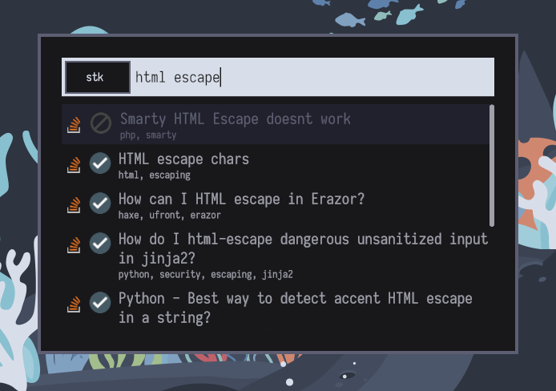

+++
title = "Writing a stackoverflow plugin for pop-launcher"
date = 2022-06-09
+++

## Introduction

In this tutorial we will build a pop-launcher plugin to search Stackoverflow  posts from your favorite
launcher. What is pop-launcher you may wonder ? Well let's take a look at the readme on the [pop-launcher repository](https://github.com/pop-os/launcher).

> Modular IPC-based desktop launcher service, written in Rust. Desktop launchers may interface with this service via 
> spawning the pop-launcher process and communicating to it via JSON IPC over the stdin and stdout pipes. The launcher 
> service will also spawn plugins found in plugin directories on demand, based on the queries sent to the service.

In short pop-launcher is a small protocol sending Json entries for an application launcher over stdout and receiving 
user queries over stdin. The general idea is to provide a common backend for application launchers that implement the protocol. 

As far as I know, there are only three frontend implementation out there: 
- [pop-shell](https://github.com/pop-os/shell): the PopOs, keyboard-driven tiling window manager layer.
- [cosmic-launcher](https://github.com/pop-os/cosmic-launcher): a gtk front-end for pop-launcher.
- [Onagre](https://github.com/oknozor/onagre): a general purpose application launcher for X and wayland.

Throughout this tutorial I am going to use Onagre to test the plugin and provide example screenshots. There is a good 
reason for this, I am the author of Onagre so I am quite familiar with it. Also, the secret goal of this article is to trick
you into installing Onagre.

## Pop-launcher plugins

If you are familiar with other linux application launcher such as rofi and wofi you might be used to write
shell scripts to extend the launcher capabilities. A very basic example would be to write a script using the `find`
command to search and list files using rofi. It's quite simple actually: the script takes the rofi user input as arguments
and rofi display the script output. Dead simple and quite efficient. 

While the pop-launcher approach resemble the rofi one, it imposes a common interface for plugin implementors which 
make the plugins easy to write and guarantee it would work regardless of the which frontend is used.
Additionally, pop-launcher provides a unified configuration format, which give the information to the frontend on how to 
use the plugin: should it keep a history, what icon should be displayed, when should the plugin be activated etc.

This small set of constraint makes it really easy to write pop-launcher plugins that works just the same on any frontend
implementation. I strongly believe it as the potential to grow a wide ecosystem, something comparable to 
[Alfred](https://www.alfredapp.com/) on macOS. If you don't know what I am talking about, take a look at 
[this list](https://github.com/learn-anything/alfred-workflows). 

Before diving into the plugin implementation here is a small demo of pop-launcher capabilities:

<video controls="controls" style="display: block; margin-left: auto; margin-right: auto; width: 80%;">
<source src="../video/onagre-demo.mp4" type="video/mp4">
</video>

## What are we going to build

It would be nice to have something we could actually use at the end of the tutorial so let's build a stackoverflow plugin. 
Every year in the stackoverflow survey, Rust rates as the most loved language so let's give some love back to stackoverflow. 
Joke aside, even if you could write a plugin in any language 
(for instance I use the [pass plugin](https://github.com/pbui/pop-launcher-scripts) written in Python), pop-launcher being
written in Rust, it also provides some interfaces doing the heavy lifting for us. 

Let us sum up, we will build a plugin to browse stackoverflow posts, using rust. 

**Requirements:**

Before getting started make sure you have the following installed:
- [rust](https://www.rust-lang.org/tools/install).
- IDE integration for rust, either [intellij-rust](https://www.jetbrains.com/rust/) or [rust-analyzer](https://rust-analyzer.github.io/).
- [pop-launcher](https://github.com/pop-os/launcher).

## Getting started

Alright you are all setup ? First let's create a new rust project with `cargo`: 

```shell
❯ cargo new pop-launcher-stackoverflow
     Created binary (application) `pop-launcher-stackoverflow` package
```

You can then open it in your editor of choice and add the following dependencies to `Cargo.toml`: 

```toml
[dependencies]
pop-launcher-toolkit = { git = "https://github.com/pop-os/launcher" }
tokio = { version = "1.18.2", features = ["rt"] }
ureq = { version = "2.4.0", features = ["json"] }
serde = { version = "^1", features = ["derive"] }
anyhow = "1.0.57"
```

Let me pause here and explain the above dependencies: 

- `pop-launcher-toolkit`:
  We need it to use the provided plugin interface, this is not mandatory, 
  but it will greatly ease the implementation. First it will take care of IPC message passing and serealization for us, 
  handle the log format and brings all the pop-launcher messages structures in scope. 
- `tokio`: internally pop-launcher uses the tokio runtime, so we need our plugin to start the runtime with the `#[tokio::main]`
  macro, provided by the `rt` feature.
- `ureq`: we are going to make some http requests to stackoverflow.
- `serde`: to deserialize the stackoverflow http responses.

### The Stackoverflow API

Before going further, let's take a look at an example response from the 
[stackoverflow REST API](https://api.stackexchange.com/docs/search#page=2&pagesize=8&order=desc&sort=votes&intitle=springboot&filter=default&site=stackoverflow&run=true):

```json
{
      "tags": [
        "java",
        "maven",
        "spring-boot",
        "manifest",
        "spring-boot-maven-plugin"
      ],
      "owner": {
        "account_id": 5457896,
        "reputation": 2754,
        "user_id": 4340793,
        "user_type": "registered",
        "accept_rate": 61,
        "profile_image": "https://www.gravatar.com/avatar/6c078df4144343cdad824bb4637b807d?s=256&d=identicon&r=PG&f=1",
        "display_name": "JeyJ",
        "link": "https://stackoverflow.com/users/4340793/jeyj"
      },
      "is_answered": true,
      "view_count": 79174,
      "accepted_answer_id": 54867850,
      "answer_count": 7,
      "score": 61,
      "last_activity_date": 1647362781,
      "creation_date": 1551101209,
      "last_edit_date": 1647292833,
      "question_id": 54867295,
      "content_license": "CC BY-SA 4.0",
      "link": "https://stackoverflow.com/questions/54867295/springboot-no-main-manifest-attribute-maven",
      "title": "SpringBoot no main manifest attribute (maven)"
    }
```

To keep things simple we are only going to display the post title its score and the link. 

Let's write the structs for deserialization: 

```rust
#[derive(Deserialize, Debug, PartialEq)]
struct StackOverFlowResponse {
  items: Vec<StackOverFlowPost>,
}

#[derive(Deserialize, Debug)]
struct StackOverFlowPost {
    title: String,
    score: i32,
    link: String,
}
```

### Querying Stackoverflow from rust 

Now that we have the datastructures to hold the API response we can query it using the `ureq` crate.

Let's approach this using the test driven development process. 
First we define a `search_posts` function, taking a string parameter and returning a `StackOverFlowResponse`. 

Pop-launcher plugins doesn't need fancy error handling, so we are going to wrap the return type within `anyhow::Result`
to easily propagate fallible statement with the `?` operator.

Finally, we omit the actual implementation and use the `todo!()` macro as a placeholder.
This macro is quite useful when using the TDD process, its equivalent to `panic!` but convey an intent of implementing
the functionality. 

```rust
fn search_posts(intitle: &str) -> Result<StackOverFlowResponse> {
  todo!()
}
```

Now that our API is defined let's write a test, pop-launcher currently display a maximum of height search results,
so we are going to limit our stackoverflow response to that amount of post. 

For readability, we use the [speculoos crate](https://crates.io/crates/speculoos) which provides fluent test assertions
via the `assert_that` macro. 

```rust
#[test]
fn should_get_posts_from_stackoverflow() {
  let posts = search_posts("spring boot");

  assert_that!(posts)
          .is_ok()
          .map(|response| &response.items)
          .has_length(8);
}
``` 

We can now run our test with `cargo test`, it should fail with the following output:

```
---- test::should_get_posts_from_stackoverflow stdout ----
thread 'test::should_get_posts_from_stackoverflow' panicked at 'not yet implemented', src/main.rs:17:1
note: run with `RUST_BACKTRACE=1` environment variable to display a backtrace
```

We can now implement the http call, calling `ureq::get`, passing the query parameter and calling the endpoint. 
finally we need to convert our result to `anyhow::Result`.

```rust
fn search_posts(intitle: &str) -> Result<StackOverFlowResponse> {
  let response = ureq::get("https://api.stackexchange.com/2.3/search?")
          .query("page", "1")
          .query("pagesize", "8")
          .query("order", "desc")
          .query("sort", "activity")
          .query("site", "stackoverflow")
          .query("intitle", &format!("\"{intitle}\""))
          .call()?;

  response.into_json().map_err(Into::into)
}
```

Let's run `cargo test` again : 

```
running 1 test
test test::should_get_posts_from_stackoverflow ... ok
```

Hooray, we have some stackoverflow posts to display! 
We can now move forward to the plugin implementation. 

### The `PluginExt` trait

Now that we are able to query posts from stackoverflow, we need to store them in a struct that implement 
the plugin functionalities. Luckily for us the `pop-launcher-toolkit` crate provides a helper trait
which comes with default behaviors for our plugin. Default implementation includes logging, and running the plugin.  
All we need to do is to implement the trait and call the `run` function to fire up our plugin. 

```rust
use pop_launcher_toolkit::launcher::Indice;
use pop_launcher_toolkit::plugin_trait::{PluginExt, async_trait};

#[derive(Default)]
struct StackOverflowPlugin {
  items: Vec<StackOverFlowPost>,
}

#[async_trait]
impl PluginExt for StackOverflowPlugin {
  fn name(&self) -> &str {
    todo!()
  }

  async fn search(&mut self, query: &str) {
    todo!()
  }

  async fn activate(&mut self, id: Indice) {
    todo!()
  }
}
```

Many things are going on here. We declared a `StackOverflowPlugin` struct, which hold our search results
and implemented the non default function provided by the `PluginExt` trait: `name`, `search` and `activate`. 
This is the bare minimum required to write pop-launcher plugin. The trait exposes other functions that come with a 
default implementation, we will use some of them later on, but for now let's focus on those three.

Finally, note that we need to decorate the `impl` declaration with the `#[async_trait]` macro. Currently, Rust
does not allow async functions in traits, the macro attribute bypass this limitation.

If you want to take a look at the available function run `cargo doc --open -p pop-launcher-toolkit` to browse 
the documentation locally. I strongly recommend to do so and take a look at the toolkit and `PluginExt` 
trait documentation. This will come in handy later on.

Ok enough talking let's implement the plugin behavior. 

**Name:**

First our plugin needs to have a name. 

```rust
fn name(&self) -> &str {
  "stackoverflow"
}
```

**Search:** 

Now we need to define how it will respond to pop-launcher search queries.

```rust
async fn search(&mut self, query: &str) {
  match query.strip_prefix("stk ") {
    Some(query) => match search_posts(query) {
      Ok(response) => self.items = response.items,
      Err(err) => error!("Failed to get posts from stackoverflow: {err}"),
    },
    None => {}
  }

  for (idx, post) in self.items.iter().enumerate() {
    self.respond_with(PluginResponse::Append(PluginSearchResult {
      id: idx as u32,
      name: post.title.clone(),
      description: post.link.clone(),
      ..Default::default()
    })).await
  }

  self.respond_with(PluginResponse::Finished).await
}
```

The first step here is to strip out the query prefix `"stk "`. Pop-launcher will only 
dispatch query to our plugin when it matches the regex defined in the `plugin.ron` config.
For now, we just assume this regex matches anything starting with `"stk "`.

Then we run the `search_posts` function with our query and store the result in the plugin struct.
Finally , dispatch the response via stdout using the `respond_with` helper function.
If an error occurs during our http call let's just log that with the `tracing::error!` macro.

Pop-launcher expect any amount of `PluginResponse::Append` messages, followed by a
`PluginResponse::Finished`, note that if we forgot to send the `Finished` message, the launcher will endlessly wait
and never display our search results. 

In the `PluginSearchResult` respond we use the post index as an identifier, which will be needed to activate the 
entry later on. We fill the `name` and `description` and leave the rest set to their default values as we don't need them
yet. 

**Activation:**

When pop-launcher request an item activation, we use the `xdg_open` helper function to open our stackoverflow link 
in the browser. Finally, we respond with `PluginResponse::Close` and we are done. 

```rust
use pop_launcher_toolkit::plugins::xdg_open;

async fn activate(&mut self, id: Indice) {
  match self.items.get(id as usize) {
    Some(post) => xdg_open(&post.link),
    None => error!("Failed to get post at index {id}"),
  }

  self.respond_with(PluginResponse::Close).await;
}
```

## Running the plugin

Now that we are done with the required implementation, the last step is to run our plugin.

```rust
#[tokio::main(flavor = "current_thread")]
async fn main() {
    let mut plugin = StackOverflowPlugin::default();
    plugin.run().await
}
```

We spawn the async tokio runtime on a single thread with `#[tokio::main(flavor = "current_thread")]`
and then all we need to do is to initialize our plugin and call the default `run` function provided by the `PluginExt`
trait. 

Before integrating this into our pop-launcher frontend we can test our plugin manually.
Since the plugin use stdin to receive query and write search results back to stdout we can run it in a terminal
and type our request. 

In the example above we sent the `{"Search": "stk async trait"}` search request and activate the first item with
`{"Activate": 0}`. This should open the stackoverflow post in new browser window:

```
/usr/bin/cargo run --color=always --package pop-launcher-stackoverflow --bin pop-launcher-stackoverflow
    Finished dev [unoptimized + debuginfo] target(s) in 0.25s
     Running `target/debug/pop-launcher-stackoverflow`
{"Search": "stk async trait"}
{"Append":{"id":0,"name":"Future is not Send, only when from async Trait","description":"https://stackoverflow.com/questions/72341910/future-is-not-send-only-when-from-async-trait","keywords":null,"icon":null,"exec":null,"window":null}}
{"Append":{"id":1,"name":"Surf dependency causes &quot;cannot be shared between threads safely&quot; error in previously compiling program with matrix_sdk and async-trait","description":"https://stackoverflow.com/questions/71077261/surf-dependency-causes-cannot-be-shared-between-threads-safely-error-in-previo","keywords":null,"icon":null,"exec":null,"window":null}}
{"Append":{"id":2,"name":"Generic async trait that returns the implemented Struct","description":"https://stackoverflow.com/questions/70995999/generic-async-trait-that-returns-the-implemented-struct","keywords":null,"icon":null,"exec":null,"window":null}}
{"Append":{"id":3,"name":"Async trait methods with associated return type and dynamic dispatch","description":"https://stackoverflow.com/questions/70713691/async-trait-methods-with-associated-return-type-and-dynamic-dispatch","keywords":null,"icon":null,"exec":null,"window":null}}
"Finished"
{"Activate": 0} 
"Close"
```

### Installing the plugin

To make pop-launcher aware of our plugin we need to write a `plugin.ron` file and move that along with our plugin binary
to the pop-launcher plugin directory. To do so, we will use [just](https://github.com/casey/just) make the installation
setup reproducible. 

**plugin.ron**

This is our plugin configuration, note that we added the stackoverflow icon downloaded from the 
[Stack-Icons repository](https://github.com/StackExchange/Stacks-Icons/blob/production/src/Icon/LogoGlyph.svg).

```ron
(
  name: "StackoverFlow",
  description: "Search Stackoverflow posts",
  bin: (
    path: "pop-launcher-stackoverflow",
  ),
  icon: Name("stackoverflow"),
  query: (
    isolate: true,
    regex: "^(stk )+",
    help: "stk ",
  )
)
```

**justfile:**

```just
#!/usr/bin/env just --justfile

install:
    cargo build --release
    mkdir -p ~/.local/share/pop-launcher/plugins/stackoverflow
    install -Dm0755 target/release/pop-launcher-stackoverflow ~/.local/share/pop-launcher/plugins/stackoverflow/pop-launcher-stackoverflow
    install -Dm644 plugin.ron ~/.local/share/pop-launcher/plugins/stackoverflow/plugin.ron
    sudo install -Dm644 LogoGlyph.svg /usr/share/pixmaps/stackoverflow.svg
```

We are all setup let run `just install` and our plugin should be available in pop-launcher. 

### Debugging

Let's test this with our pop-launcher frontend : 


Strange, I works but feels a bit slow, also the search result does not always match the query I was typing.

Let's take a look at the plugin logs at `~/.local/state/pop-launcher/stackoverflow.log` : 

```shell
.local/state/pop-launcher
❯ tail -f stackoverflow.log
2022-05-28T08:05:28.012486Z ERROR pop_launcher_stackoverflow: Failed to get posts from stackoverflow: 
https://api.stackexchange.com/2.3/search?page=1&pagesize=8&order=desc&sort=activity&site=stackoverflow&intitle=
: status code 400
```

Mhh, it seems we are sending a request with the `intitle=` parameter empty.

Let's adjust the `search` function so it does not try to make empty queries : 

```rust
async fn search(&mut self, query: &str) {
  match query.strip_prefix("stk ") {
    Some(query) if !query.is_empty() => match search_posts(query) {
      Ok(response) => self.items = response.items,
      Err(err) => error!("Failed to get posts from stackoverflow: {err}"),
    },
    _ => {}
  }

  for (idx, post) in self.items.iter().enumerate() {
    self.respond_with(PluginResponse::Append(PluginSearchResult {
      id: idx as u32,
      name: post.title.clone(),
      description: post.link.clone(),
      ..Default::default()
    })).await
  }

  self.respond_with(PluginResponse::Finished).await
}
```

It kinda works, but we still have to send an icon per entry, and it's overall quite slow.

You can take a look at the current implementation here: [pop-launcher-stackoverflow/step1](https://github.com/oknozor/pop-launcher-stackoverflow/tree/tutorial/step1) 

By now you should be able to write your own simple plugins.
However, our stackoverflow plugin is far from being ready, let's now dive into more advanced stuff. 

## Advanced implementation

Our main issue here is that we are getting our search results via HTTP which is very slow compared to plugins
getting their entries via the file system, or anything locally available on our machine really.

Mix that with async code and things get messy. Maybe you noticed, sometime the plugin will display result
from a previous query instead of the current one. pop-launcher will read the last search result we sent but since our code
runs asynchronously there is no guarantee http request will respond in the order they were issued.

To get thing right we need to make use of the interrupt mechanism provided by pop-launcher: prior to sending new
search query, pop-launcher will send an interrupt signal. Upon receiving this signal we will cancel all ongoing requests
except the current one.

### Sending interrupts

This will require a bit of refactoring and if you are new to rust this is going to be somewhat challenging. 
Please bear with me while we detail the implementation.

1. **broadcasting the interrupt:**

Every time we have a new search request we will need to pair it with a receiver listening for interruption requests. 
Because of that we need a multi-consumer, multi-producer channel, aka [`tokio::sync::broadcast`](https://docs.rs/tokio/latest/tokio/sync/broadcast/index.html). 

First we need hold the channel in our plugin struct: 

```rust
struct StackOverflowPlugin {
    items: Vec<StackOverFlowPost>>,
    interrupt: broadcast::Sender<()>,
}
```

And then, dispatch the interruption request send by pop-launcher to our tokio tasks by overriding the
`interrupt` function in the `PluginExt` impl block.  

```rust
#[async_trait]
impl PluginExt for StackOverflowPlugin {
// ...
    async fn interrupt(&mut self) {
        // Notify the ongoing search tasks they need to interrupt
        let _ = self.interrupt.send(());
        // Clear the current search results
        self.items.clear();
        // Tell pop-launcher we are done
        self.respond_with(PluginResponse::Finished).await;
    }
}
```

2. **The `select!` macro**

To implement the interrupt mechanism we will use the tokio [`select!`](https://tokio.rs/tokio/tutorial/select) macro, which allows waiting on multiple
async computations and returns when a single computation completes.

```rust
tokio::spawn(async move {
    select! {
        // Make our http call to stackoverflow
        query_result = search_posts(&query) => {
            // Do something with our results
        }

        // Just return on interrupt request
        Ok(()) = interrupt.recv() => {
            // Do nothing
        }
    }
});
```

Here we spawn a tokio task selecting between either a completed search request or an interruption.
This is where thing gets a little complicated if you are not familiar rust ownership rules, lifetime and the
[borrow checker](https://doc.rust-lang.org/book/ch04-00-understanding-ownership.html).

Let's demonstrate the problem with a simple example: 

```rust
    async fn search(&mut self, query: &str) {
        tokio::spawn(async move {
            self.items = search_posts(query).unwrap().items;
        });
    }
```

Here we tried to wrap our search function in a tokio task, so we can later implement the interruption mechanism.
Compiling this will produce the following error: 

```
error[E0759]: `self` has lifetime `'life0` but it needs to satisfy a `'static` lifetime requirement
   --> src/main.rs:22:26
    |
22  |     async fn search(&mut self, query: &str) {
    |                          ^^^^ this data with lifetime `'life0`...
23  |         tokio::spawn(async move {
    |         ------------ ...is used and required to live as long as `'static` here
    |
note: `'static` lifetime requirement introduced by this bound
   --> /home/okno/.cargo/registry/src/github.com-1ecc6299db9ec823/tokio-1.18.2/src/task/spawn.rs:127:28
    |
127 |         T: Future + Send + 'static,
    |                            ^^^^^^^
```

The problem is that tokio task requires any values in its scope to live for the `'static` lifetime. 
Our plugin struct is accessed via a mutable reference here, and we have no guarantee it will live long enough. 
Worst, even if we somehow managed to guarantee our plugin lifetime is valid, we would need to take multiple mutable 
references to our plugin struct (one per tokio task). This violates rust [ownership rules](https://doc.rust-lang.org/book/ch04-02-references-and-borrowing.html).

3. **Wrapping everything together**:

To bypass these limitations we need to add an extra layer of message passing and ensure concurrent search results can be written 
in a thread safe way. To achieve this we will need a mutable thread-safe, reference-counting smart pointer aka `Arc<Mutex>`: 

```rust
struct StackOverflowPlugin {
    items: Arc<Mutex<Vec<StackOverFlowPost>>>,
    search_tx: mpsc::Sender<Vec<StackOverFlowPost>>,
    interrupt: broadcast::Sender<()>,
}
```

Our `PluginExt::search` function will now hold the search/interrupt logic : 

```rust
// ... 

tokio::spawn(async move {
    select! {
        query_result = search_posts(&query, &access_token) => {
            match query_result {
                Ok(query_result) => sender.send(query_result.items).await.expect("Failed to send query result"),
                Err(why) => error!("Failed to obtain query result from github: {why}")
            }
        }

        Ok(()) = interrupt.recv() => {
            // Just return from this future
        }
    }
});
```

We can now handle search results in a separate async task top get read of the lifetime limitation: 

```rust
async fn dispatch_search_result(
    search_rx: &mut Receiver<Vec<StackOverFlowPost>>,
    search_results: Arc<Mutex<Vec<StackOverFlowPost>>>,
) {
    while let Some(new_results) = search_rx.recv().await {
        // Wrap the mutex guard into a scope so we don't hold it across the async `send` method.
        let plugin_responses: Vec<PluginResponse> = {
            let mut search_results = search_results.lock().unwrap();
            *search_results = new_results;

            search_results
                .iter()
                .enumerate()
                .map(|(idx, entry)| entry.to_plugin_response(idx as u32)) // Convert the entry to a PluginResponse
                .collect()
        };

        // Dispatch messages to pop-launcher, notice we don't use the `respond_with` function since
        // We are outside of the `PluginExt` implementor.
        for search_result in plugin_responses {
            send(&mut tokio::io::stdout(), search_result).await;
        }

        send(&mut tokio::io::stdout(), PluginResponse::Finished).await;
    }
}
```

Finally, we need to update our `main` function: 

```rust
#[tokio::main(flavor = "current_thread")]
async fn main() {
    // Our search results channel
    let (search_tx, mut search_rx) = tokio::sync::mpsc::channel(8);
    // The interrupt channel, notice we don't use the base receiver here. 
    // New receiver are created with the `subscribe` function.
    let (interrupt, _) = broadcast::channel(8);
    // Our thread safe, mutable smart pointer to the search results
    let search_results = Arc::new(Mutex::new(vec![]));

    // Our plugin struct, now holding the interrupt broadcast sender, the search results sender and the 
    // search result pointer.
    let mut plugin = StackOverflowPlugin {
        items: Arc::clone(&search_results),
        search_tx,
        interrupt,
    };

    // Last but not least, we use the `tokio::join!` macro to run our plugin 
    // And the dispatch task concurrently. 
    let _ = tokio::join!(
        plugin.run(),
        dispatch_search_result(&mut search_rx, search_results)
    );
}
```

### The final touch

If you followed the previous step carefully the plugin should now be working again.

But there are still few things we can improve: 
- stackoverflow json responses sometime contains unescaped html characters.
- displaying urls in the search result description in not very useful, tags would probably be better.  
- we still don't have a main icon for our search results.
- Stackoverflow API imposes request quotas for non-authenticated users.

Let's first handle how we display the search results by adding the `tags` and `is_answered`
json attributes.

```rust
#[derive(Deserialize, Debug, PartialEq)]
struct StackOverFlowPost {
    title: String,
    score: i32,
    link: String,
    tags: Vec<String>,
    is_answered: bool,
}
```

I omitted the `to_plugin_response` implementation on purpose in the previous section. We will now implement it,
so it displays the post tags, escape html characters with the `htmlescape` crate and use different
icons for answered posts : 

```rust
impl StackOverFlowPost {
    fn tags(&self) -> String {
        self.tags.join(", ")
    }

    fn to_plugin_response(&self, idx: u32) -> PluginResponse {
        PluginResponse::Append(PluginSearchResult {
            id: idx as u32,
            name: decode_html(&self.title.clone()).expect("Decode error").to_string(),
            description: decode_html(&self.tags()).expect("Decode error").to_string(),
            icon: if self.is_answered {
                Some(IconSource::Name(Cow::Owned("emblem-checked".to_string())))
            } else {
                Some(IconSource::Name(Cow::Owned("error".to_string())))
            },
            ..Default::default()
        })
    }
}
```

Finally, we will add another config file to use a stackoverflow `access_token`. I won't explain the 
details here, but you can take a look at the final result: [oknozor/pop-launcher-stackoverflow](https://github.com/oknozor/pop-launcher-stackoverflow)

```rust
#[derive(Deserialize)]
struct PluginConfig {
    access_token: String,
}

pub fn access_token() -> Result<String> {
    let config = find("stackoverflow")
        .find(|path| path.exists())
        .ok_or_else(|| anyhow!("'config.ron' config file not found for stackoverflow plugin"));

    let config = config?;
    let config = std::fs::read_to_string(config)?;
    let config: PluginConfig = ron::from_str(&config)?;
    Ok(config.access_token)
}
```

And it's done !  



## Conclusion

As we saw in the first part, creating a simple plugin is quite straight forward. 
However, things can get complicated if you enter the realm of concurrency and smart pointers.

Most of the time plugins won't need this kind of  async shenanigans and if you feel overwhelmed by the 
Rust async ecosystem you could still write your plugin with a more permissive language. 

If something in this tutorial was unclear please don't hesitate to send a PR or to reach out on Twitter. 

I hope you are now going to implement your own plugins. 
Please share your plugins on [lucas-dclrcq/awesome-pop-launcher](https://github.com/lucas-dclrcq/awesome-pop-launcher), 
we maintain an exhaustive list of community plugins here, and we would be delighted to see the list grow. 

Happy coding !


